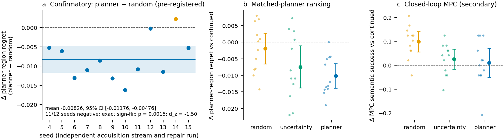
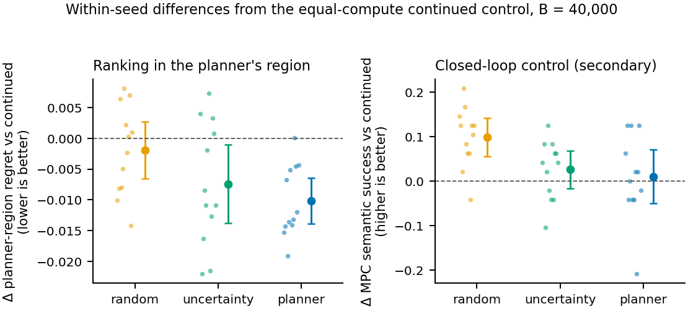

# Planner Atlas

**When a planner optimizes through a learned latent world model, does it select the model's
consequential errors, and does repairing the model on the planner's own trajectories fix them
better than random or uncertainty-selected data?**

Studied with the released [LeWM](https://github.com/lucas-maes/le-wm) latent world models, on PushT
(Atlas and repair) and TwoRoom (Atlas), under equal environment-interaction and equal
repair-compute budgets.

> **Provenance.** Every confirmatory and replay-weight number below was produced by commit
> `2d6364d` (tag `results-confirm2`). Later commits are maintenance for future runs and have not
> regenerated any result. The full write-up is [docs/report.md](docs/report.md); every number in it
> and here is computed by [scripts/summarize_results.py](scripts/summarize_results.py) into
> [docs/results/summary.json](docs/results/summary.json).



*(a) Pre-registered primary contrast: planner − random planner-region regret per seed, with the mean
and its 95% CI. (b, c) Differences from the equal-compute continued-training control within each
seed: planner-selected data improves ranking of the planner's own candidates, and random data
improves closed-loop MPC. Panel (c) is a secondary, descriptive metric. Error bars: 95% t intervals
over 12 seeds.*

**Takeaway.** A world model does not have a single scalar notion of being better. Repairing it on
trajectories a planner selected made it rank that planner's candidate plans better: the
pre-registered contrast with random acquisition is −0.0083 regret, 95% CI [−0.0118, −0.0048], 11 of
12 seeds, exact sign-flip p = 0.0015. Random exploratory data instead improved closed-loop MPC, by a
route this study does not identify. Held-out prediction loss tracked neither effect.

## Why held-out prediction loss is not enough

- **Optimization concentrates on errors.** On PushT, the plan CEM chooses is more optimistic than a
  typical proposal: the model underestimates its true latent cost by more. This selection
  amplification grows with optimization pressure, from 10.6 ± 4.7 to 51.1 ± 13.3 latent-cost
  units. The chosen plans' rollout error rises from 0.056 to 0.128, while a typical proposal's stays
  near 0.043. Average-case error understates the error on the plans that actually get executed.
- **Loss and usefulness come apart after repair.** Mean held-out loss orders the repaired branches
  continued (0.00675) < random (0.00726) < planner (0.00740) < uncertainty (0.00750). Mean
  planner-region regret orders them planner < uncertainty < random < continued, and mean MPC success
  orders them random > uncertainty > planner > continued. The released model has the worst held-out loss
  (0.00989), yet its regret is no worse than the continued-training control's mean: 0.0559 against
  0.0591 on the planner region, and 0.0394 against 0.0450 on q0.

## Method in brief

| component | choice |
| --- | --- |
| Model | Released LeWM PushT checkpoint: ViT-tiny encoder and projector to a 192-d latent, a 6-layer causal predictor. Actions come in blocks of 5 raw 2-d actions. |
| What trains | Only the dynamics (action encoder, predictor, predictor projection). The representation stays frozen, and BatchNorm keeps the released running statistics. |
| Objective | Upstream teacher-forced one-step latent MSE. SIGReg has zero gradient when the encoder is frozen, so it is omitted. |
| Planners | CEM and random shooting over 5-block plans (25 raw steps). Cost is the squared latent distance of the predicted final latent to the goal. Pressures P0–P3 are 128×1, 128×2, 256×4 and 512×6 CEM samples × iterations. |
| Latents | Every observation is a live render of a simulator state reconstructed by replaying the recorded episode. Training latents come from the same renderer. |
| Data | Official PushT expert dataset: 18,685 episodes, 2.34 M frames. 10% of episodes (1,868) are held out, and acquisition never touches them. |
| Task metrics | Task cost = block position error / 512 + angle error / π. Semantic success = block within 20 px and π/9 of its goal pose. |

**Optimism** of a plan is its realized latent cost minus its predicted latent cost. A positive
value means the model thought the plan ended closer to the goal than it did. **Top-choice regret**
is the true task cost of the candidate the model ranks best, minus the best true task cost in the
pool. Candidate pools are executed once and shared by every model, so every branch ranks identical
plans against identical outcomes.

## Planner-Exploitation Atlas

The Atlas audits the released models without repair. It compares each planner's chosen plan with
32 plans sampled from the planners' initial proposal (q0).


| PushT, 50 cases (mean ± SE over cases) | P0 128×1 | P1 128×2 | P2 256×4 | P3 512×6 |
| --- | ---: | ---: | ---: | ---: |
| selection amplification, CEM | 10.6 ± 4.7 | 24.1 ± 7.9 | 32.1 ± 9.5 | 51.1 ± 13.3 |
| selection amplification, random shooting | 10.6 ± 4.7 | 11.7 ± 7.7 | 22.4 ± 5.1 | 19.3 ± 7.5 |
| rollout error of CEM's chosen plan | 0.056 | 0.087 | 0.099 | 0.128 |
| rollout error of a q0 proposal (mean) | 0.042 | 0.044 | 0.045 | 0.041 |

Amplification is positive at every pressure, for both planners, in both environments. In TwoRoom it
is 13–26 and shows no clear trend with pressure. These Atlas runs are descriptive. They predate
the repair protocol and were produced with the code of commits `7a7f75a` (PushT) and `7d62e8c`
(TwoRoom). Their rows carry no commit stamp, and both encode the goal from its recorded frame.

### What each acquisition strategy collects

Each of 12 seeds walks 1,600 shared training-split contexts. Every strategy picks one 5-block plan
per context and pays 25 simulator transitions for it, 40,000 in total. Selection sees only
predictions, never outcomes.

- **random**: one plan drawn from q0.
- **uncertainty**: the q0 plan, out of 128 candidates, with the largest variance of predicted goal
  cost across a 5-member bootstrap ensemble.
- **planner**: the plan P2 CEM returns with the released model.

| mean over 12 seeds (each seed: 1,600 plans) | random | uncertainty | planner |
| --- | ---: | ---: | ---: |
| signed optimism | +8.8 | +18.9 | +48.4 |
| absolute optimism | 20.3 | 51.3 | 50.8 |
| rollout error | 0.0468 | 0.1299 | 0.1227 |
| terminal error | 0.0796 | 0.2659 | 0.2673 |
| true task cost | 0.269 | 0.245 | 0.105 |
| semantic success | 0.08 | 0.17 | 0.67 |

Uncertainty and planner selection both find high-error regions, with 2.6–2.8× random's rollout
error and 3.3–3.4× its terminal error. The planner's regions are also strongly positively
optimistic and task-relevant. Uncertainty does not fail here: it selects a different kind of data.
Every planner-vs-random ordering in the table holds in all 12 seeds; the table is descriptive, not a
pre-registered test.
([figure](docs/figures/acquisition.png))

## Confirmatory repair experiment

Pre-registered before any confirmatory branch was trained. The documents are
[protocol](docs/protocols/confirmatory-protocol.md) and
[amendment 1](docs/protocols/confirmatory-amendment-1.md), and every result row records the
amendment's digest.

- **Hypothesis.** At B = 40,000 transitions, planner-selected acquisition gives lower planner-region
  top-choice regret than random acquisition after identical repair compute.
- **Design.** 12 fresh seeds (4–15), each an independent acquisition stream and repair run. Branches
  per seed: continued (B = 0), random, uncertainty and planner. Every branch starts from the released
  checkpoint and takes 1,000 AdamW steps (lr 5e-5, batch 128), with 50/50 base/acquired windows for
  B > 0. The branches differ only in which transitions exist.
- **Evaluation.** 48 frozen cases from held-out episodes ([manifest](docs/protocols/confirmatory-manifest.json)).
  The planner-region pool is 32 plans from the final proposal of the released model's P2 CEM,
  executed once and shared by all branches.
- **Inference.** The seed is the unit. The pre-registered test is the exact two-sided sign-flip
  permutation test over all 2¹² sign assignments of the per-seed differences.


| branch (12 seeds; 95% CI) | planner-region regret | q0 regret | MPC semantic success | held-out loss |
| --- | ---: | ---: | ---: | ---: |
| released model (one model, reference) | 0.0559 | 0.0394 | 0.625 | 0.00989 |
| continued, B = 0 | 0.0591 [0.0557, 0.0625] | 0.0450 | 0.644 [0.613, 0.675] | 0.00675 |
| random | 0.0572 [0.0529, 0.0614] | 0.0451 | 0.743 [0.715, 0.771] | 0.00726 |
| uncertainty | 0.0517 [0.0466, 0.0568] | 0.0423 | 0.670 [0.639, 0.701] | 0.00750 |
| planner | **0.0489** [0.0450, 0.0529] | 0.0427 | 0.655 [0.613, 0.696] | 0.00740 |

**Primary result (confirmed).** Planner − random planner-region regret = **−0.008261**, 95% CI
[−0.011759, −0.004764], 11 of 12 seeds negative, **exact sign-flip p = 0.0015** (pre-registered),
Cohen's d_z = −1.50. The paired t-test (t(11) = −5.20, p = 0.0003) and the exact Wilcoxon test
(p = 0.0015) are supplementary checks. The confirmed effect is about half the size of the
superseded 3-seed exploratory estimate (−0.0147), consistent with the winner's curse on an estimate
that motivated its own confirmation.

**Scope.** The planner stream and the planner-region evaluation pool come from the same planner
configuration: the released model's P2 CEM, at training-split contexts and at held-out cases
respectively. The confirmed statement is therefore narrower than it might sound: training on
trajectories selected by a given planner improves candidate ranking on trajectories generated by
that same planner, relative to random acquisition. The one available cross-planner check is the
true task cost of each branch's own P3 CEM plan, where the repaired model generates its own
candidates at higher pressure. There, planner − random = −0.0039, 95% CI [−0.0109, +0.0031],
sign-flip p = 0.25. This is exploratory and statistically unresolved, so generalization across
planners is not established.

## Planner vs random: two different kinds of better



Within each seed, compared with the equal-compute continued control:

- **Planner-selected data** improves planner-region regret by −0.0102 [−0.0138, −0.0065], 11/12
  seeds. It produces no clear change in MPC semantic success: +0.010 [−0.050, +0.071].
- **Random data** produces no clear change in planner-region regret: −0.0019 [−0.0065, +0.0027].
  It improves MPC semantic success by +0.099 [+0.056, +0.142], 11/12 seeds, sign-flip p = 0.0015.

MPC was a secondary, descriptive metric under the protocol, so the random-data control gain is not
a separately confirmed hypothesis. It is also not evidence that planner repair hurts control. The
planner branch stays near the continued control's level; the planner-vs-random MPC gap (−0.089)
exists because random data improves MPC. Held-out loss is worse than the continued control's for
every repair branch in 12/12 seeds, because acquired batches displace base batches. Yet the best
ranking and the best control come from two different branches, and neither is the branch with the
best held-out loss ([figure](docs/figures/held_out_vs_downstream.png)).

## Exploratory post-confirmation replay-weight analysis

> This analysis was conducted after completion and inspection of the preregistered confirmatory
> experiment and therefore deviates from the preregistered stopping rule. It is exploratory and was
> not pre-registered. Its own [design note](docs/protocols/replay-weight-protocol.md) was recorded
> before its branches were trained.

The weight α on acquired data took the values 0, 0.125, 0.25 and 0.5, for random and planner
acquisition, with the same 12 streams and all else fixed. α = 0 is the continued control, and α =
0.5 reuses the confirmatory branches.


| mean over 12 seeds | α = 0 | 0.125 | 0.25 | 0.5 |
| --- | ---: | ---: | ---: | ---: |
| planner: planner-region regret | 0.0591 | 0.0526 | 0.0512 | 0.0489 |
| random: planner-region regret | 0.0591 | 0.0561 | 0.0563 | 0.0572 |
| planner: MPC semantic success | 0.644 | 0.649 | 0.663 | 0.655 |
| random: MPC semantic success | 0.644 | 0.696 | 0.688 | 0.743 |
| planner: held-out loss | 0.00675 | 0.00684 | 0.00698 | 0.00740 |
| random: held-out loss | 0.00675 | 0.00681 | 0.00691 | 0.00726 |

More planner-data weight steadily improves planner-region ranking and leaves MPC within ±0.02 of
the continued control (+0.005, +0.019, +0.010). More random-data weight leaves ranking roughly flat
and raises MPC. Held-out loss rises with α for both strategies: between consecutive α ≥ 0.125 it
rises in every seed, and from α = 0 to 0.125 in 12/12 (planner) and 10/12 (random) seeds. A
specialization-versus-forgetting trade-off would predict that lowering the planner-data weight
recovers control as held-out loss recovers. It does not, so that explanation is not supported. The
data show no planner control deficit for forgetting to explain.

## Limitations

- **Matched planner.** The confirmed ranking gain is measured on candidates from the same planner
  configuration that selected the repair data. Cross-planner generalization (the P3 check) is
  unresolved.
- **One environment and one budget.** Repair was confirmed on PushT at B = 40,000 only. The budget
  curve (2,500 and 10,000) exists only in the superseded exploratory grid, where no effect appeared
  at the smaller budgets (+0.0052 and −0.0013, 3 seeds).
- **Planner vs uncertainty is unresolved.** On planner-region regret the difference is −0.0027
  [−0.0102, +0.0047]. Uncertainty-selected data also improves on the continued control (−0.0074,
  exploratory). Planner acquisition is not shown to be best overall.
- **Control results are secondary.** The MPC dissociation is descriptive, and the replay-weight
  analysis is exploratory and broke the stopping rule.
- **Coverage is a hypothesis only.** Planner data sits slightly closer to the base latent
  distribution than random data (nearest-base distance 2.64 against 2.84). It is not narrower: total
  variance is 185 against 192, and the participation ratio is 82.7 against 78.7. Random data may
  help MPC by covering off-nominal recovery states, but this was not tested.
- **Fixed setting.** Frozen representation, one model family, CEM planners, 5 ensemble members, 48
  evaluation cases.
- **Goal rendering.** The confirmatory runs encoded each goal from its recorded frame, 0.69 latent L2
  off the live-render manifold used everywhere else. That changes a case's start-to-goal cost by
  1.3% on average. Every branch shares it. It is fixed for future runs (protocol `frozen_rep_v3`)
  but was not rerun.

## Reproduction

The venv, the data, the latent cache and all run outputs live on local disk outside the repository.
The confirmatory pipeline takes about 4 GPU-hours on one RTX 3090, plus a one-time 1.8 GB latent
cache.

```bash
export UV_PROJECT_ENVIRONMENT=/local/disk/venvs/planner-atlas   # never inside the repo
uv sync --locked
DATA=/local/disk          # pusht_expert_train.h5 and weights.pt, see below
RUNS=$DATA/runs/confirm   # outputs
git checkout results-confirm2          # the exact code that produced the confirmatory results
```

- **Dataset**: `pusht_expert_train.h5.zst` from `huggingface.co/datasets/quentinll/lewm-pusht` at
  revision `655cd446b9929369d7d406001da85c15d1457850` (archive sha256 `7cfbd6d9…`).
- **Checkpoint**: `weights.pt` of `huggingface.co/quentinll/lewm-pusht` (sha256 `48938400…`, recorded
  in every result row).

```bash
# 1. live-render latent cache (built on the first run) and the 5-member uncertainty ensemble
for m in 0 1 2 3 4; do
  uv run python scripts/train_dynamics.py --env pusht --dataset $DATA/pusht_expert_train.h5 \
    --checkpoint $DATA/weights.pt --latent-cache $DATA/pusht-live-latents.h5 \
    --output $DATA/member$m.pt --member $m --seed 0 --epochs 1
done

# 2. acquisition: 3 strategies x 12 seeds, 40,000 transitions each
for seed in $(seq 4 15); do for s in random uncertainty planner; do
  uv run python scripts/acquire.py --strategy $s --budget 40000 --stream-seed $seed \
    --dataset $DATA/pusht_expert_train.h5 --checkpoint $DATA/weights.pt \
    --members $DATA/member{0,1,2,3,4}.pt --output $RUNS/acquisition/$s-seed$seed.h5
done; done

# 3. repair and evaluation: 49 branches x 48 cases
cp docs/protocols/confirmatory-manifest.json $RUNS/manifest.json   # or let seed 307 regenerate it
cp docs/protocols/confirmatory-amendment-1.md $RUNS/protocol-amendment.md
uv run python scripts/repair_experiment.py --dataset $DATA/pusht_expert_train.h5 \
  --checkpoint $DATA/weights.pt --latent-cache $DATA/pusht-live-latents.h5 \
  --acquisition-dir $RUNS/acquisition --manifest $RUNS/manifest.json --manifest-seed 307 \
  --protocol $RUNS/protocol-amendment.md --budgets 40000 --seeds $(seq 4 15) \
  --output $RUNS/grid.jsonl --dynamics-dir $RUNS/branches

# 4. summary and figures (at the current commit; they only read the outputs)
git checkout main
uv run python scripts/summarize_results.py --confirm-dir $RUNS --output $RUNS/summary.json
uv run --group figures python scripts/make_figures.py \
  --summary $RUNS/summary.json --output $RUNS/figures
```

Training and evaluation are seeded. Rerunning a branch reproduced its 48 result rows bit for bit on
the same machine. The replay-weight branches rerun step 3 with `--repair-fraction 0.125` or `0.25`
and `--branches random:40000:<seed> planner:40000:<seed>`. `summarize_results.py` also accepts
`--replay-rows`, `--atlas` and `--coverage`; the committed `docs/results/summary.json` used all
three (see the [report](docs/report.md#10-reproducibility)). On the current commit (`frozen_rep_v3`), steps 1–3
use live-rendered goals and refuse `frozen_rep_v2` checkpoints and streams, so their outputs will
differ from the confirmatory ones.

Tests and lint: `uv run pytest`, `uv run ruff check`, `uv run ruff format --check`,
`uv run pre-commit run --all-files`.

## Repository structure

```text
src/planner_atlas/
  models/reference_lewm.py  released LeWM, bit-identical to the official loading route
  envs.py data.py           environment boundary and the action-block contract
  planning.py atlas.py      CEM, random shooting, pressures, Atlas metrics
  pusht.py evaluation.py    PushT replay reconstruction, task metrics, MPC; TwoRoom cases
  training.py repair.py     frozen-representation dynamics training and mixed-batch repair
  acquisition.py            random / uncertainty / planner selection with transition accounting
  uncertainty.py            bootstrap ensemble and cost-variance uncertainty
  statistics.py             seed-level paired inference (exact sign-flip, t, Wilcoxon)
scripts/
  tworoom_atlas.py pusht_atlas.py        the Atlas
  train_dynamics.py acquire.py           ensemble members and acquisition streams
  repair_experiment.py                   repair grid and evaluation
  summarize_results.py make_figures.py   every reported number and figure
docs/
  report.md                paper-style write-up
  protocols/               pre-registration, amendment, manifest, replay-weight note (verbatim)
  results/summary.json     all reported numbers, with input digests
  figures/                 generated figures (PNG and PDF)
tests/                     unit and integration tests
```

## Status and citation

The research phase is finished and no further experiments are planned. The confirmatory result is
final as reported. The code is released under the MIT license.

```bibtex
@misc{bhardwaj2026planneratlas,
  author = {Yash Bhardwaj},
  title  = {Planner Atlas: optimization-induced failures and planner-targeted repair
            in latent world models},
  year   = {2026},
  note   = {Confirmatory results produced by commit 2d6364d (tag results-confirm2)}
}
```

This work builds on the released LeWM checkpoints and datasets (`quentinll/lewm-pusht`,
`quentinll/lewm-tworooms`), the reference implementation `lucas-maes/le-wm` (read at `8edfeb3`) and
the `stable-worldmodel` environments. Please cite those works as well.
