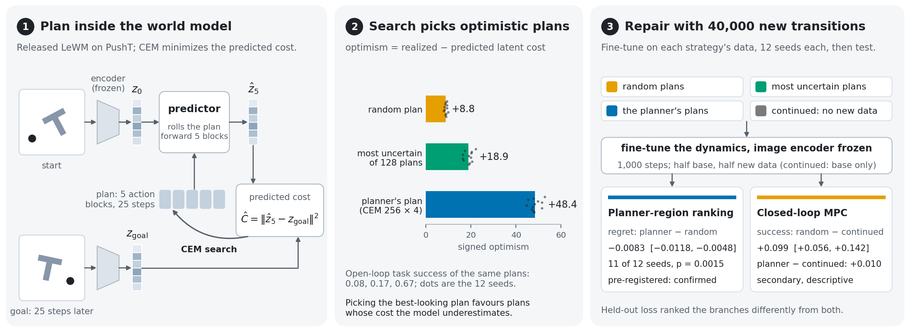

# Planner Atlas

Is a planner's own experience the best data for repairing the world model it plans with? This is a
pre-registered study on the PushT manipulation task, using the released
[LeWM](https://github.com/lucas-maes/le-wm) latent world model.



## Summary

When a planner searches through a learned world model, it favours plans whose cost the model
underestimates. We gave three kinds of repair data the same environment budget (40,000
transitions) and the same training compute:
- random plans;
- the plans a model ensemble disagrees on most;
- the planner's own plans.

**Planner data repairs that planner's ranking.** Compared with random data, it lowered the model's
top-choice regret on the planner's candidate plans by 14%.
- The effect was −0.0083, 95% CI [−0.0118, −0.0048], in 11 of 12 seeds.
- The pre-registered exact sign-flip test gave p = 0.0015.
- The effect was not distinguishable from that of uncertainty-selected data.
- It was not shown to transfer to other planners.

**Random data improves closed-loop control.** Against an equal-compute control, MPC success rose
by +0.099 with random data and by +0.010 with planner data. This is a secondary metric.

**Held-out loss tracks neither.** The model with the best held-out prediction loss ranked the
planner's candidates worst.

**Search selects optimistic errors.** Planner-chosen plans were much more over-optimistic than
random ones: optimism +48.4 against +8.8, in latent-cost units. A later pre-registered study tested
random shooting over a fixed proposal. It found no consistent evidence that deeper search degrades
the model's choices beyond the ordinary optimizer's curse, so its hypothesis was a NO-GO.

In this setting, "a better world model" depended on what it was used for.

## Method

**Setup.**
- *Model:* the released LeWM PushT checkpoint, with a ViT-tiny encoder, a 192-d latent and a
  transformer predictor. The encoder is frozen and only the dynamics are fine-tuned.
- *Planning:* CEM and random shooting over 25-step plans, scored by predicted latent distance to
  the goal.
- *Evaluation:* 48 held-out cases.

**Rigor.**
- The hypothesis, metric, seeds, analysis and stopping rule were pre-registered.
- There are 12 independent seeds, and the seed is the unit of inference.
- Every strategy has equal budgets, and an equal-compute continued-training control is included.
- Candidate pools are executed once and shared by every model.
- Every result row is stamped with its commit and protocol digest.
- Exploratory analyses and negative results are reported as such.

## Documentation

- [Report](docs/report.md): every experiment, result, closed study and correction, plus the full
  reproduction pipeline.
- [Claims ledger](docs/results/scientific_ledger.md): each claim with its evidence and status.
- [Protocols](docs/protocols/): the pre-registrations and amendments, verbatim.

## Repository

```text
src/planner_atlas/   world model, planners, environments, training, acquisition, statistics
scripts/             experiments, result summaries and figures
docs/                report, protocols, results and figures
tests/               unit and integration tests
```

## Quickstart

```bash
export UV_PROJECT_ENVIRONMENT=/path/outside/the/repo   # keep the environment out of the repo
uv sync --locked
uv run pytest                                          # CPU only, no data needed
uv run --group figures python scripts/make_figures.py --summary docs/results/summary.json \
  --output docs/figures --stage1-summary docs/results/optimization_depth_stage1_summary.json
```

The figures are redrawn from the committed result summaries. Rerunning the experiments needs the
LeWM PushT dataset and checkpoint and a CUDA GPU; the confirmatory experiment takes about 4
GPU-hours on an RTX 3090. The [report](docs/report.md#16-reproducibility) gives the full pipeline,
the pinned inputs and the tagged commit behind each result.

## Citation

```bibtex
@misc{bhardwaj2026planneratlas,
  author = {Yash Bhardwaj},
  title  = {Planner Atlas: planner-selected errors and planner-targeted repair
            in latent world models},
  year   = {2026},
  url    = {https://github.com/sudo-YashBhardwaj/planner-atlas}
}
```

This work builds on the released [LeWM](https://github.com/lucas-maes/le-wm) checkpoints, datasets
and reference implementation, and on the `stable-worldmodel` environments. The code is released
under the [MIT license](LICENSE).
