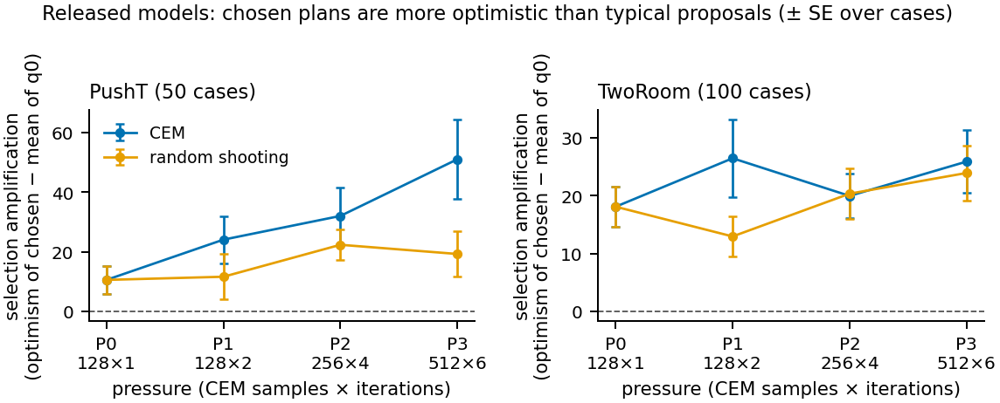
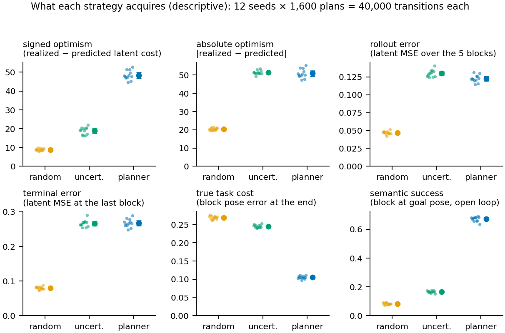
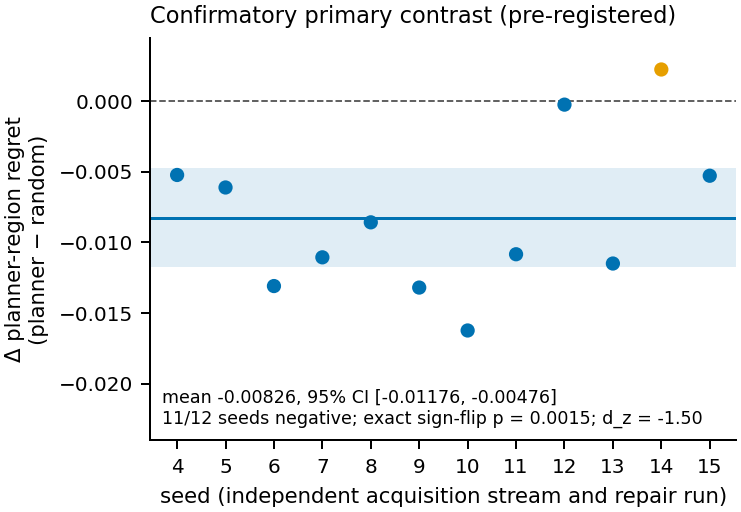
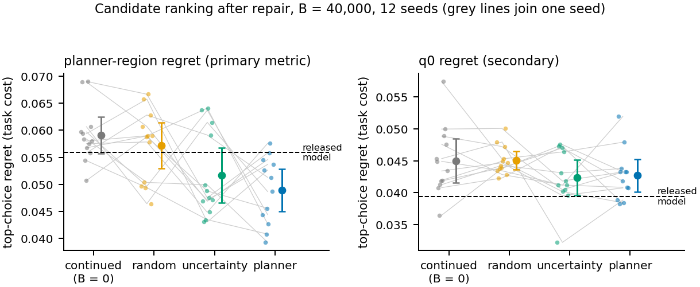
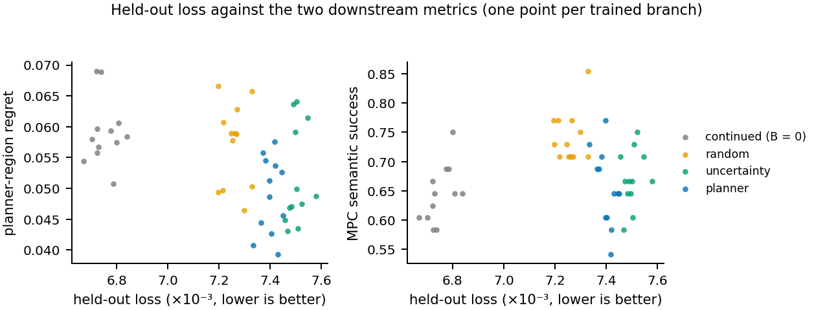
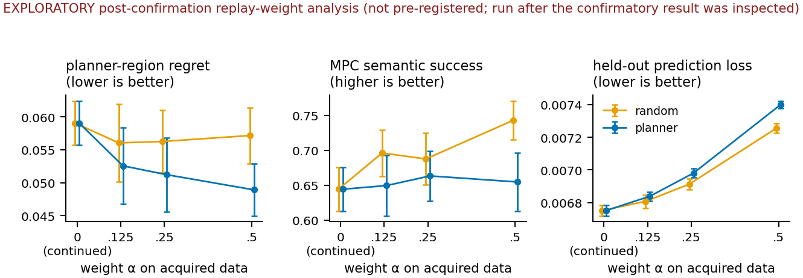

# Planner-targeted repair of a latent world model improves matched-planner ranking, not control

**Status.** Final report, 2026-09-22. The confirmatory and replay-weight results were produced by
commit `2d6364d` (tag `results-confirm2`). Every number here is computed from the run artifacts by
`scripts/summarize_results.py` into `docs/results/summary.json`, and every figure is drawn from that
file by `scripts/make_figures.py`. Section labels mark each result as **CONFIRMATORY** (the one
pre-registered hypothesis), **SECONDARY** (pre-registered as descriptive), **DESCRIPTIVE** (not
pre-registered, measured on the confirmatory run) or **EXPLORATORY** (analysed or run after the fact).

## Abstract

Planners that optimize through a learned world model select the actions the model scores best, so
they are drawn towards the model's errors. We audit this on PushT and TwoRoom with the released LeWM
latent world model. We then ask whether data collected by the planner itself repairs the model
better than random or uncertainty-selected data, at equal environment interaction (40,000
transitions) and equal repair compute.

Optimization selects plans whose realized latent cost exceeds the prediction by more than a typical
proposal's does, and this selection amplification grows with CEM pressure on PushT. Planner-selected
acquisition gathers trajectories with 2.6× the rollout error of random acquisition, strongly
positive optimism (+48.4 against +8.8) and far greater task relevance (semantic success 0.67 against
0.08). Uncertainty-selected data has comparable error but is neither as optimistic nor as
task-relevant.

In a pre-registered 12-seed experiment, repairing on planner-selected data lowered top-choice regret
on candidates drawn from the same planner's search region, relative to random data: −0.00826, 95% CI
[−0.01176, −0.00476], 11/12 seeds, exact sign-flip p = 0.0015. Because acquisition and evaluation
share the planner, the claim is scoped to that planner. A check with the repaired model's own
higher-pressure planner is small and unresolved (−0.0039, p = 0.25).

Random data instead improved closed-loop MPC over an equal-compute control (+0.099 semantic success;
secondary). Planner data produced no clear change in MPC. Held-out prediction loss ordered the
branches differently from both downstream metrics. A world model therefore has no single scalar notion of
being better.

## 1 Introduction

Latent world models such as LeWM are trained to predict the next latent state on logged data and
then used for planning: a sampling-based optimizer (here the cross-entropy method, CEM) searches
action sequences whose predicted final latent is closest to a goal latent. Their evaluation usually
reports held-out one-step prediction loss on the logged distribution. But a planner does not sample
from that distribution. It searches for the plans the model scores best, which favours plans whose
cost the model underestimates. The errors that matter are the ones the optimizer selects, and those
may be rare under the logged data.

This suggests an acquisition strategy for model repair: pay for simulator interaction on exactly the
trajectories the planner chooses, then retrain on them. The strategy is natural, but it competes with
two simpler baselines at the same interaction budget. Random exploration gives broad coverage.
Ensemble-uncertainty selection is the standard active-learning choice.

The project answers three questions, in order:

1. **Atlas.** Does optimization pressure select trajectories with larger, positively signed model
   error (optimism)?
2. **Acquisition.** What does each acquisition strategy actually collect?
3. **Repair.** Under equal interaction and compute, does planner-selected data repair the model
   better, and better at what?

## 2 Claims and their status

| # | claim | evidence | status |
| --- | --- | --- | --- |
| 1 | Optimization through the latent model selects trajectories with substantially higher model error and positive optimism than random acquisition. | Atlas; acquisition streams | DESCRIPTIVE, every seed |
| 2 | Uncertainty selection also targets high-error regions, but planner-selected trajectories are far more task-relevant and far more positively optimistic. | acquisition streams | DESCRIPTIVE, every seed |
| 3 | At equal interaction and repair compute, planner-selected acquisition improves candidate ranking under the same planner's distribution, relative to random acquisition. | 12-seed pre-registered experiment | **CONFIRMATORY** |
| 4 | Planner-selected and random acquisition give different downstream benefits: planner data improves same-planner ranking, random data improves closed-loop MPC, and held-out loss predicts neither well. | same experiment; replay-weight analysis | SECONDARY / EXPLORATORY |
| L | Cross-planner generalization of the ranking gain is not established. | P3 own-plan check | EXPLORATORY, unresolved |

## 3 Setting and method

### 3.1 Model

The released LeWM checkpoints (`quentinll/lewm-pusht` and `quentinll/lewm-tworooms`) are loaded
bit-identically to the official route. Frames at 224×224 pass through a ViT-tiny encoder (CLS token)
and a BatchNorm projector into a 192-d latent z. A 6-layer causal transformer predictor, with the
released dropout of 0.1 and a BatchNorm output projection, maps the history of latents and action
embeddings to the next latent. An action block is 5 raw 2-d actions, so a 5-block plan spans 25
simulator steps. A plan's predicted cost is ‖ẑ₅ − z_goal‖²; its realized cost uses the latent of the
frame actually reached.

### 3.2 Task and cases

PushT cases pair a start state with the recorded state 25 steps later in the same expert episode,
which serves as the goal. A mid-episode PushT state cannot be set exactly, because the recorded
state omits velocities and contact state. Each start is therefore reconstructed by restoring the
episode's initial state and replaying the recorded actions. This matches the recording to about
1e-3 px except for a 0.3% contact-divergence tail. The model observes live renders of these
reconstructed states.

- **Task cost**: block position error / 512 + wrapped angle error / π.
- **Semantic success**: position within 20 px and angle within π/9 of the goal pose. These are
  PushT's own tolerances, without the agent-position condition of official success.

The dataset is the official PushT expert set: 18,685 episodes and 2,336,736 frames. An episode-level
split (seed 0) holds out 10%, 1,868 episodes. Evaluation cases come only from held-out episodes, and
acquisition contexts only from training episodes.

### 3.3 Planners and pressure

CEM and random shooting sample 5-block plans from a Gaussian proposal, clamped to the valid action
range. Four pressures P0–P3 give CEM 128×1, 128×2, 256×4 and 512×6 samples × iterations, with 10%
elites. Random shooting gets the same total samples in a single iteration. The initial proposal q0 is
N(0, I) over normalized action blocks.

### 3.4 Quantities

- **Optimism** O = realized latent cost − predicted latent cost. O > 0 means the model believed
  the plan ended closer to the goal than it did.
- **Selection amplification** = O of the chosen plan − mean O of 32 q0 audit plans.
- **Rollout error**: mean squared latent error over the 5 predicted blocks.
- **Terminal error**: mean squared latent error at the last block.
- **Top-choice regret of a pool**: true task cost of the candidate with the lowest predicted cost,
  minus the lowest true task cost in the pool.

### 3.5 Dynamics training

The representation (encoder and projector) is frozen in eval mode. Only the action encoder,
predictor and predictor projection train. The objective is upstream's (le-wm `8edfeb3`): a
teacher-forced one-step latent MSE over windows of 4 observations 5 raw steps apart. The SIGReg term
is omitted because its gradient is exactly zero when the encoder is frozen.

The predictor projection's BatchNorm keeps the released running statistics while its affine
parameters train. Otherwise a normalization layer adapting to each branch's data would be a second,
distribution-dependent repair mechanism.

Training seeds both torch and the window sampler, because dropout is live. Training latents are live
renders of the replayed dataset, the same renderer that planning and evaluation use; recorded
dataset pixels sit about 0.7 latent L2 from the live render of the same state. This is protocol
`frozen_rep_v2`.

## 4 Experimental design

### 4.1 Atlas (released models, no repair)

The TwoRoom Atlas has 100 cases and the PushT Atlas 50. For each case, pressure and planner it
records:
- the chosen plan's predicted and realized costs, optimism, errors and true task outcome;
- a 32-plan q0 audit shared by both planners, and for CEM a 32-plan audit of its final proposal;
- one block-level MPC episode.

### 4.2 Acquisition

Each seed samples a fixed pool of 1,600 contexts (start, goal) from training-split episodes, and
every strategy walks them in the same permuted order. For each context a strategy chooses one 5-block
plan using only pre-execution information, then pays 25 simulator transitions to execute it. Over
1,600 plans this is exactly 40,000 transitions.

- **Random**: one sample from q0.
- **Uncertainty**: of 128 q0 samples, the one with the largest population variance of predicted goal
  cost across a 5-member ensemble. Random and uncertainty draw from the same per-context generator.
- **Planner**: the plan returned by P2 CEM (256×4) with the released model.

The ensemble members are the released checkpoint trained for one epoch (13,947 steps) on
independent bootstraps of the 1,785,252 training windows. This lowers held-out loss from 0.00997 to
0.0058–0.0059.

### 4.3 Repair

Every branch starts from the released checkpoint. Each takes 1,000 AdamW steps with lr 5e-5, weight
decay 1e-3, gradient clip 1.0 and batch 128. Branches with B > 0 draw 64 base training windows and 64
acquired windows per batch, both with replacement. A 5-block trajectory gives 3 windows, so 4,800
acquired windows are each seen about 13 times. The **continued** control takes the same steps on base
windows only.

Branches differ only in which transitions exist. Optimizer, steps, mixture, normalization and
training seed are shared, and the training seed equals the stream seed.

### 4.4 Evaluation

The frozen manifest has 48 cases, from 48 distinct held-out episodes. Two candidate pools per case
are executed once and shared by every branch:
- **q0**: 32 plans from the initial proposal.
- **planner region**: 32 plans sampled from the final proposal of the released model's P2 CEM, the
  region the optimizer actually searches.

Each branch is scored on:
- top-choice regret on both pools;
- the true outcome and latent errors of its own P3 CEM plan, executed open loop;
- one MPC episode (P3 CEM, replanning every block, at most 50 raw steps, ending at semantic success);
- held-out prediction loss on 20,000 windows sampled (seed 909) from 1,867 held-out episodes.

### 4.5 Statistical analysis

The seed is the unit of replication. Each seed is an independent acquisition stream and repair run,
and its 48 cases are repeated measurements of one trained model. A contrast is the vector of 12
per-seed differences of case means.

The pre-registered test is the exact two-sided sign-flip permutation test over all 2¹² sign
assignments. Reported beside it are the mean, SD, SE, a 95% t interval (t₀.₉₇₅,₁₁ = 2.201), the paired
t-test, the exact Wilcoxon signed-rank test, Cohen's d_z and the count of seeds with each sign.
Secondary contrasts carry no multiplicity correction and are descriptive. The Atlas audits a single
fixed model on independently drawn cases, so its uncertainty is a standard error over cases.

## 5 Confirmatory protocol

| step | when | artifact (sha256) |
| --- | --- | --- |
| protocol registered: hypothesis, metric, seeds, analysis, stopping rule | 2026-09-20, before any confirmatory branch | `docs/protocols/confirmatory-protocol.md` (`b05621fe…`) |
| code fixed: seeded dropout, live-render latents, T − 2 repair windows, random held-out subsample | 2026-09-20 22:18 | commit `2d6364d` |
| amendment 1: fresh manifest (seed 307), seeds 4–15 | 2026-09-20 23:09 | `docs/protocols/confirmatory-amendment-1.md` (`32d69d8d…`) |
| frozen manifest | 2026-09-20 | `docs/protocols/confirmatory-manifest.json` (`5e945883…`) |
| acquisition: 36 streams | 2026-09-20 23:10 to 09-21 01:15 | streams record commit `2d6364d` |
| repair and evaluation: 49 branches × 48 cases | 2026-09-21 01:19 to 03:02 | `grid.jsonl`, 2,352 rows, commit and digests in every row |

The amendment was forced by the protocol-correction pass between registration and launch. The
original manifest (`86ed349f…`) had been consumed by a one-seed protocol-validation run whose results
were inspected. Seed 3 had been observed in a smoke run. Everything else was unchanged: the
hypothesis, the primary metric, the seed as unit, the branch set, the training and planner settings,
and the analysis plan.

The stopping rule reads: "No follow-up study (in particular no replay-mixture study) is launched
from this experiment." Section 7.2 reports the deviation from it.

## 6 Results

### 6.1 Optimization selects optimistic errors (Atlas, DESCRIPTIVE)



| PushT, 50 cases (mean ± SE) | P0 | P1 | P2 | P3 |
| --- | ---: | ---: | ---: | ---: |
| selection amplification, CEM | 10.6 ± 4.7 | 24.1 ± 7.9 | 32.1 ± 9.5 | 51.1 ± 13.3 |
| selection amplification, random shooting | 10.6 ± 4.7 | 11.7 ± 7.7 | 22.4 ± 5.1 | 19.3 ± 7.5 |
| optimism of CEM's plan / of a q0 plan | 17.7 / 7.0 | 32.2 / 8.1 | 39.9 / 7.8 | 59.8 / 8.7 |
| rollout error of CEM's plan / of a q0 plan | 0.056 / 0.042 | 0.087 / 0.044 | 0.099 / 0.045 | 0.128 / 0.041 |
| true task cost of CEM's plan | 0.224 | 0.165 | 0.146 | 0.137 |

- **PushT.** More pressure buys better plans (task cost 0.224 → 0.137) and increasingly optimistic
  errors: amplification rises roughly fivefold, and the chosen plan's rollout error triples relative
  to a typical proposal's.
- **TwoRoom.** Amplification is positive but flat across pressure: 18.1, 26.4, 19.9 and 25.9 for
  CEM, and 13–24 for random shooting. A typical proposal is pessimistic there (mean q0 optimism
  about −13) while CEM's chosen plan is optimistic (+5 to +13).

The Atlas predates the repair protocol. It used the code of commits `7a7f75a` (PushT) and `7d62e8c`
(TwoRoom), and it encodes goals from recorded frames. It is descriptive evidence for claim 1, not a
test.

### 6.2 What each strategy acquires (DESCRIPTIVE)



| 12 seeds × 1,600 plans; mean [range over seeds] | random | uncertainty | planner |
| --- | ---: | ---: | ---: |
| signed optimism | +8.8 [7.9, 9.8] | +18.9 [16.2, 22.1] | +48.4 [44.7, 52.7] |
| absolute optimism | 20.3 [19.5, 21.3] | 51.3 [49.2, 53.4] | 50.8 [47.3, 55.1] |
| rollout error | 0.0468 [0.0423, 0.0512] | 0.1299 [0.1240, 0.1405] | 0.1227 [0.1145, 0.1314] |
| terminal error | 0.0796 [0.0722, 0.0878] | 0.2659 [0.2537, 0.2896] | 0.2673 [0.2478, 0.2887] |
| true task cost | 0.269 [0.261, 0.277] | 0.245 [0.240, 0.253] | 0.105 [0.098, 0.112] |
| semantic success (open loop) | 0.08 [0.07, 0.09] | 0.17 [0.15, 0.18] | 0.67 [0.64, 0.69] |

The seed ranges of planner and random never overlap, so every ordering between them holds in all 12
seeds.

- **Uncertainty** finds high-error regions as effectively as the planner: 2.8× random's rollout
  error against the planner's 2.6×. Its errors are much less one-sided (signed/absolute optimism
  0.37 against the planner's 0.95), and its plans barely make task progress.
- **Planner** errors are almost entirely optimistic, and its plans mostly succeed.

Uncertainty is therefore a working baseline that selects a different kind of data, not a failed
one. The strategies faced identical contexts in every seed (checked from the stream records).

### 6.3 Primary result (CONFIRMATORY)



| per-seed planner − random planner-region regret | |
| --- | --- |
| seeds 4–15 | −0.00523, −0.00611, −0.01309, −0.01106, −0.00858, −0.01320, −0.01623, −0.01084, −0.00025, −0.01150, +0.00224, −0.00528 |
| mean, SD, SE | −0.008261, 0.005504, 0.001589 |
| 95% CI | [−0.011759, −0.004764] |
| **exact sign-flip permutation test (pre-registered)** | **p = 0.0015** (6 of 4,096 assignments) |
| paired t-test (supplementary) | t(11) = −5.199, p = 0.0003 |
| exact Wilcoxon signed-rank (supplementary) | p = 0.0015 |
| Cohen's d_z | −1.501 |
| seeds with the predicted sign | 11 / 12 |

The pre-registered hypothesis is supported. The effect is a 14% reduction of the random branch's
planner-region regret (0.0572 → 0.0489).

**Scope.** The planner stream was generated by the released model's P2 CEM at training contexts. The
planner-region pool is sampled from the same planner's final proposal at held-out cases. The
confirmed statement is therefore:

> Training on trajectories selected by a given planner improves candidate ranking on trajectories
> generated by that same planner, relative to random acquisition.

It does not show that planner-targeted repair generally improves decision-relevant reliability
(section 7.1).

### 6.4 Secondary metrics (SECONDARY, descriptive)



Branch means over 12 seeds, with 95% t intervals over seeds. The released model is a single
deterministic reference.

| metric | released | continued | random | uncertainty | planner |
| --- | ---: | ---: | ---: | ---: | ---: |
| planner-region regret (primary) | 0.0559 | 0.0591 [0.0557, 0.0625] | 0.0572 [0.0529, 0.0614] | 0.0517 [0.0466, 0.0568] | 0.0489 [0.0450, 0.0529] |
| q0 regret | 0.0394 | 0.0450 [0.0415, 0.0484] | 0.0451 [0.0436, 0.0465] | 0.0423 [0.0395, 0.0451] | 0.0427 [0.0401, 0.0452] |
| MPC semantic success | 0.625 | 0.644 [0.613, 0.675] | 0.743 [0.715, 0.771] | 0.670 [0.639, 0.701] | 0.655 [0.613, 0.696] |
| own P3 plan: absolute optimism | 62.3 | 54.3 [50.0, 58.5] | 54.5 [50.0, 59.0] | 49.2 [45.1, 53.4] | 46.4 [42.2, 50.6] |
| own P3 plan: signed optimism | 61.7 | 53.4 [49.2, 57.5] | 53.6 [49.3, 57.8] | 48.3 [43.8, 52.8] | 45.5 [41.2, 49.8] |
| own P3 plan: rollout error | 0.1414 | 0.1223 [0.1113, 0.1333] | 0.1208 [0.1105, 0.1311] | 0.1159 [0.1034, 0.1284] | 0.1026 [0.0947, 0.1105] |
| own P3 plan: terminal error | 0.3343 | 0.2802 [0.2560, 0.3044] | 0.2822 [0.2612, 0.3032] | 0.2614 [0.2391, 0.2837] | 0.2414 [0.2189, 0.2639] |
| held-out loss | 0.00989 | 0.00675 [0.00672, 0.00678] | 0.00726 [0.00723, 0.00729] | 0.00750 [0.00748, 0.00752] | 0.00740 [0.00738, 0.00742] |

Paired contrasts over seeds: mean [95% CI], exact sign-flip p, uncorrected. Only the first cell of
the first row is confirmatory.

| metric | planner − random | planner − continued | random − continued | uncertainty − continued | planner − uncertainty |
| --- | ---: | ---: | ---: | ---: | ---: |
| planner-region regret | **−0.0083 [−0.0118, −0.0048], p = 0.0015** | −0.0102 [−0.0138, −0.0065], p = 0.0010 | −0.0019 [−0.0065, +0.0027], p = 0.38 | −0.0074 [−0.0138, −0.0011], p = 0.029 | −0.0027 [−0.0102, +0.0047], p = 0.43 |
| q0 regret | −0.0024 [−0.0053, +0.0006], p = 0.11 | −0.0023 [−0.0057, +0.0011], p = 0.18 | +0.0001 [−0.0030, +0.0032], p = 0.97 | −0.0027 [−0.0074, +0.0021], p = 0.23 | +0.0004 [−0.0030, +0.0037], p = 0.81 |
| MPC semantic success | −0.089 [−0.132, −0.046], p = 0.0020 | +0.010 [−0.050, +0.071], p = 0.76 | +0.099 [+0.056, +0.142], p = 0.0015 | +0.026 [−0.016, +0.068], p = 0.23 | −0.016 [−0.056, +0.025], p = 0.51 |
| own P3 plan: absolute optimism | −8.1 [−13.2, −3.1], p = 0.0049 | −7.9 [−14.6, −1.2], p = 0.028 | +0.2 [−7.1, +7.6], p = 0.94 | −5.1 [−11.1, +0.9], p = 0.088 | −2.8 [−8.2, +2.6], p = 0.27 |
| own P3 plan: rollout error | −0.0182 [−0.0310, −0.0054], p = 0.011 | −0.0197 [−0.0351, −0.0043], p = 0.013 | −0.0015 [−0.0184, +0.0155], p = 0.85 | −0.0064 [−0.0203, +0.0074], p = 0.35 | −0.0133 [−0.0269, +0.0004], p = 0.053 |
| held-out loss | +0.00014 [+0.00013, +0.00016], p = 0.0005 | +0.00065 [+0.00063, +0.00067], p = 0.0005 | +0.00051 [+0.00048, +0.00053], p = 0.0005 | +0.00075 [+0.00072, +0.00079], p = 0.0005 | −0.00010 [−0.00013, −0.00007], p = 0.0005 |

What these secondary results show, descriptively:

- **Ranking.** Planner data also beats the continued control on planner-region regret. Uncertainty
  data sits between random and planner, and planner − uncertainty is unresolved. On q0 candidates no
  strategy clearly differs.
- **Control.** Random data raises MPC semantic success by +0.099 over the continued control (11/12
  seeds). Planner data produces no clear change: +0.010, CI spanning zero. The planner − random MPC gap
  (−0.089) is random's gain, not a planner deficit. This does not show that planner repair hurts
  control.
- **Exploitability.** Planner repair lowers the optimism and error of the plan the repaired model's
  own P3 planner chooses (absolute optimism −8.1 against random): that optimizer finds less
  exploitable error. The true task cost of that plan is not resolved (section 7.1).

### 6.5 Held-out loss does not track usefulness (SECONDARY, descriptive)



Mean held-out loss orders the trained branches continued < random < planner < uncertainty. Every
repair branch is worse than the continued control in 12/12 seeds, because acquired batches displace
base batches. Yet:
- the best matched-planner ranking comes from planner data;
- the best MPC comes from random data;
- the branch with the best held-out loss (continued) has the worst mean planner-region regret.

The released model has the worst held-out loss of all, 0.00989, because it was trained on
recorded-pixel latents. Continued training cuts that loss by a third, yet the released model's
regret is no worse than the continued branches' mean: 0.0559 against 0.0591 [0.0557, 0.0625] on the
planner region, and 0.0394 against 0.0450 [0.0415, 0.0484] on q0. Held-out prediction loss is
therefore not a sufficient scalar measure of a world model's usefulness to a planner.

## 7 Exploratory analyses

### 7.1 Cross-planner check (EXPLORATORY)

The own-plan evaluation uses a different generator from the planner-region pool. Candidates come
from the repaired model rather than the released one, and the pressure is higher: P3, 512×6 against
P2, 256×4. Its true task cost was not among the pre-registered metrics.

Planner − random own-plan task cost is −0.0039, 95% CI [−0.0109, +0.0031], 9/12 seeds, exact
sign-flip p = 0.25 (t-test p = 0.24). The difference is smaller than the matched-planner effect and
statistically unresolved, so generalization across planners is not established.

### 7.2 Post-confirmation replay-weight analysis (EXPLORATORY)

> This analysis was conducted after completion and inspection of the preregistered confirmatory
> experiment and therefore deviates from the preregistered stopping rule.

A design note was recorded before its branches were trained (`docs/protocols/replay-weight-protocol.md`,
`5e7d7dd6…`). It is not a pre-registration.

- **Design.** The weight α on acquired data took the values 0.125 and 0.25 (16 or 32 of 128 windows
  per batch), with random and planner streams for seeds 4–15. That is 48 new branches on the same
  code, manifest, pools and settings.
- **Reused branches.** α = 0 is the continued control and α = 0.5 the confirmatory branches.
- **Integrity checks.** The replay rows record commit `2d6364d`, and their shared pools are identical
  to the confirmatory ones. One branch rerun from scratch reproduced its 48 rows bit for bit.



| mean [95% CI over 12 seeds] | α = 0 (continued) | 0.125 | 0.25 | 0.5 |
| --- | ---: | ---: | ---: | ---: |
| planner: planner-region regret | 0.0591 [0.0557, 0.0625] | 0.0526 [0.0467, 0.0584] | 0.0512 [0.0456, 0.0569] | 0.0489 [0.0450, 0.0529] |
| random: planner-region regret | 0.0591 [0.0557, 0.0625] | 0.0561 [0.0501, 0.0620] | 0.0563 [0.0515, 0.0611] | 0.0572 [0.0529, 0.0614] |
| planner: MPC semantic success | 0.644 [0.613, 0.675] | 0.649 [0.606, 0.693] | 0.663 [0.627, 0.699] | 0.655 [0.613, 0.696] |
| random: MPC semantic success | 0.644 [0.613, 0.675] | 0.696 [0.663, 0.729] | 0.688 [0.650, 0.725] | 0.743 [0.715, 0.771] |
| planner: held-out loss | 0.00675 | 0.00684 | 0.00698 | 0.00740 |
| random: held-out loss | 0.00675 | 0.00681 | 0.00691 | 0.00726 |

| within seed, vs continued | α = 0.125 | 0.25 | 0.5 |
| --- | ---: | ---: | ---: |
| planner: Δ planner-region regret | −0.0065 [−0.0127, −0.0003] | −0.0079 [−0.0129, −0.0028] | −0.0102 [−0.0138, −0.0065] |
| planner: Δ MPC semantic success | +0.005 [−0.048, +0.058] | +0.019 [−0.020, +0.058] | +0.010 [−0.050, +0.071] |
| random: Δ planner-region regret | −0.0030 [−0.0099, +0.0038] | −0.0028 [−0.0084, +0.0028] | −0.0019 [−0.0065, +0.0027] |
| random: Δ MPC semantic success | +0.052 [+0.004, +0.100] | +0.043 [+0.005, +0.082] | +0.099 [+0.056, +0.142] |

- **Planner-data weight** steadily improves P2 planner-region ranking and leaves MPC around the
  continued control's level at every α.
- **Random-data weight** leaves planner-region ranking roughly flat and improves MPC. The rise is not
  strictly monotone: 0.696 at α = 0.125, 0.688 at 0.25.
- **Held-out loss** rises with α for both strategies. Every step from α = 0.125 upward increases it
  in 12/12 seeds. The step from 0 to 0.125 does so in 12/12 planner seeds and 10/12 random seeds.
- **Planner vs random** differs clearly only at α = 0.5. At 0.125 and 0.25 the regret differences
  are −0.0035 (p = 0.24) and −0.0051 (p = 0.11).

**What this does not support.** A specialization-versus-forgetting trade-off would predict that
lowering the planner-data weight recovers control as held-out loss recovers. Held-out loss does
recover, but planner MPC stays level, so that explanation is not supported. Lowering the replay
weight does not recover planner control, and there was no planner control deficit to recover: the
planner branches never differ from the continued control. Neither replay weighting nor catastrophic
forgetting explains the random-vs-planner control gap.

### 7.3 Coverage of the acquired data (EXPLORATORY, descriptive)

Latent statistics of executed blocks 1–5 against 100,000 training-split latents of the live cache.
Values are mean ± SE over 12 seeds.

| | random | planner |
| --- | ---: | ---: |
| true task cost / semantic success | 0.269 / 0.08 | 0.105 / 0.67 |
| latent total variance (covariance trace) | 191.8 ± 0.1 | 185.2 ± 0.1 |
| participation ratio | 78.7 ± 0.2 | 82.7 ± 0.2 |
| distance to nearest base latent | 2.84 ± 0.01 | 2.64 ± 0.01 |
| Mahalanobis distance to base | 14.22 ± 0.01 | 13.75 ± 0.01 |
| nearest-base distance, blocks 1 → 5 | 2.16 → 3.33 | 1.93 → 3.11 |

Planner data is much more task-concentrated. It is not obviously narrower: its total variance is 3%
lower but its participation ratio is 5% higher. It lies somewhat closer to the base (expert)
distribution than random data, which drifts further off-manifold at every block.

A possible hypothesis is that random exploration covers off-nominal and recovery states that MPC
needs after its own deviations. No experiment here tests this; it is not a result.

### 7.4 The superseded exploratory grid (EXPLORATORY, superseded)

The grid that motivated the confirmatory experiment ran 3 seeds (0–2) at budgets of 2,500, 10,000 and
40,000, at commit `2fcb9e7`. An audit then found four defects:
- unseeded dropout in repair, so branches were not reproducible;
- training latents from recorded pixels instead of live renders;
- an off-by-one that dropped a repair window per trajectory;
- a held-out prefix covering only 196 episodes.

All were fixed in `2d6364d` before registration of the amendment. On that grid, planner − random
planner-region regret was +0.0052, −0.0013 and −0.0147 at the three budgets. The 40,000 estimate is
about 1.8× the confirmed one, as the winner's curse would lead one to expect. The smaller budgets
were never rerun under the corrected protocol, so no budget curve is established.

## 8 Limitations

- **Matched planner.** The confirmed ranking gain is measured on candidates from the planner
  configuration that also selected the repair data. The one cross-planner check is unresolved.
- **Scale.** Repair was studied in one environment (PushT), at one budget (40,000 transitions), one
  mixture (50/50) and one repair length (1,000 steps). All models share a frozen representation and
  a single model family (LeWM). The planners are CEM variants.
- **Uncertainty baseline.** One ensemble construction was used: 5 bootstrap members after one epoch,
  with cost variance as the score. Other uncertainty estimators could select different data. Planner
  vs uncertainty on the primary metric is unresolved.
- **Evaluation size.** 48 evaluation cases per branch and one MPC episode per case. MPC success is
  a coarse, 1/48-grained score per seed.
- **Status of the control results.** The MPC and held-out results are pre-registered secondary
  descriptives. The replay-weight and coverage analyses are exploratory, and the replay-weight
  analysis violated the stopping rule.
- **Goal encoding.** The confirmatory and replay runs encoded each goal from its recorded dataset
  frame, 0.69 latent L2 (mean over the 48 cases) off the live-render manifold. The squared shift is
  0.2% of the squared start-to-goal distance. Through the cross term it changes a case's
  start-to-goal cost by 1.3% on average and by at most 9.4%. Every branch shares it, and so does
  acquisition. It is fixed for future runs in commit `f563e85` (protocol `frozen_rep_v3`), which was
  not used to rerun anything.
- **Atlas provenance.** The Atlas runs predate commit stamping in the output rows and use
  recorded-frame goals.

## 9 Discussion

The central finding is a dissociation. A world model does not have a single scalar notion of being
better:
- Data selected by a planner improved reliability under that planner's induced distribution: the
  confirmed matched-planner ranking gain.
- Random exploratory data improved closed-loop control instead, by a route this study does not
  identify.
- Held-out prediction loss captured neither distinction. It preferred the continued control, which
  was worst on planner-region ranking and no better at control.

For model-based RL and world-model evaluation, this argues for reporting decision-relevant
metrics under the distribution a given planner induces, and for naming the planner. "The model got
better" has no single meaning. Planner-targeted acquisition is a reasonable way to make a model
reliable for a specific optimizer. This study gives no reason to expect it to transfer to other
planners or to improve control by itself.

**What these results do not show:**
- that planner-selected repair is globally best;
- that it improves MPC, or that it hurts MPC relative to continued training;
- that uncertainty selection is useless;
- that replay weighting or catastrophic forgetting explains the control gap;
- that planner data is geometrically narrower;
- that the ranking gain generalizes across planners;
- that the replay-weight study was pre-registered;
- that the t-test (p = 0.0003) is the primary test: the pre-registered test is the exact sign-flip
  permutation test (p = 0.0015).

## 10 Reproducibility

**Code versions.**

| version | role |
| --- | --- |
| `2d6364d` (tag `results-confirm2`) | produced every confirmatory and replay-weight row; each row and stream records it |
| `f563e85` | maintenance only: live-rendered goals, protocol `frozen_rep_v3`, 16-row base windows (matching the T − 2 repair windows), one subsampling helper, one MPC success flag. It refuses v2 checkpoints and streams and has regenerated no result. |

The summary and figure scripts read the artifacts at any later commit. `docs/results/summary.json`
records two different commits:
- `generation.source_commit` is the code that generated the file. The file is committed
  afterwards, so it is stored in a later commit.
- `confirmatory.provenance.git_commit` is the code that produced the results (`2d6364d`).

**Inputs.**
- **Dataset**: `pusht_expert_train.h5` from `huggingface.co/datasets/quentinll/lewm-pusht` at revision
  `655cd446b9929369d7d406001da85c15d1457850` (archive sha256 `7cfbd6d9…`).
- **Checkpoint**: `weights.pt` from `quentinll/lewm-pusht`, sha256
  `48938400ae3464c9680731287f583a9cb516f55a8ec64ea13a91be47fb15b607`.
- **Environment**: pinned in `uv.lock` (Python 3.10, torch 2.14.0, stable-worldmodel 0.1.1,
  transformers 5.8.1).

**Artifacts.** These live on local disk, outside the repository. The summary records each by file
name and sha256.

| artifact | sha256 |
| --- | --- |
| confirmatory `grid.jsonl` (2,352 rows) | recorded in `docs/results/summary.json` |
| manifest | `5e9458839dccb124ccd94394853a8592b79b27c94a11c4819bbe040dd8b5d746` |
| protocol / amendment | `b05621fe…` / `32d69d8d…` (the amendment's digest is in every row) |
| replay rows (α = 0.125, 0.25) | `542f326c…` / `ccb4594f…` |
| replay design note | `5e7d7dd6…` |
| Atlas rows (PushT, TwoRoom) | `fd573d9f…` / `70d79bd5…` |

**Determinism.** Repair and evaluation seed every generator. A replay branch rerun in a separate
process reproduced all 48 rows bit for bit on the same machine. Encoding the same frames in a
different batch composition changes latents at float-rounding level, so bitwise equality across
machines or batch layouts is not promised.

**Commands.** The full pipeline is in the README (section "Reproduction"): environment, latent
cache and ensemble, acquisition, repair grid, summary and figures. It takes about 4 GPU-hours on an
RTX 3090. The committed summary was produced with:

```bash
uv run python scripts/summarize_results.py --confirm-dir $RUNS/confirm2 \
  --replay-rows $RUNS/replay/alpha0125-merged.jsonl $RUNS/replay/alpha025.jsonl \
  --replay-protocol $RUNS/replay/protocol.md \
  --atlas pusht=$RUNS/pusht-atlas/atlas50.jsonl tworoom=$RUNS/tworoom-atlas/dev100.jsonl \
  --coverage --dataset $DATA/pusht_expert_train.h5 --checkpoint $DATA/weights.pt \
  --latent-cache $DATA/pusht-live-latents.h5 --output docs/results/summary.json
uv run --group figures python scripts/make_figures.py \
  --summary docs/results/summary.json --output docs/figures
```

`alpha0125-merged.jsonl` joins two halves of the α = 0.125 run, which a session teardown
interrupted. The halves hold disjoint branches, and the summary script rejects any branch that does
not cover exactly the 48 manifest cases.
