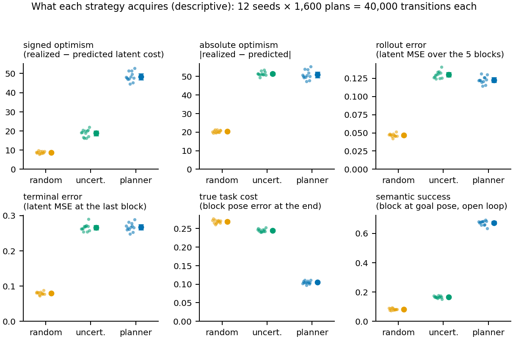
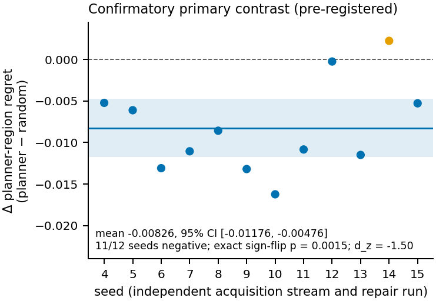
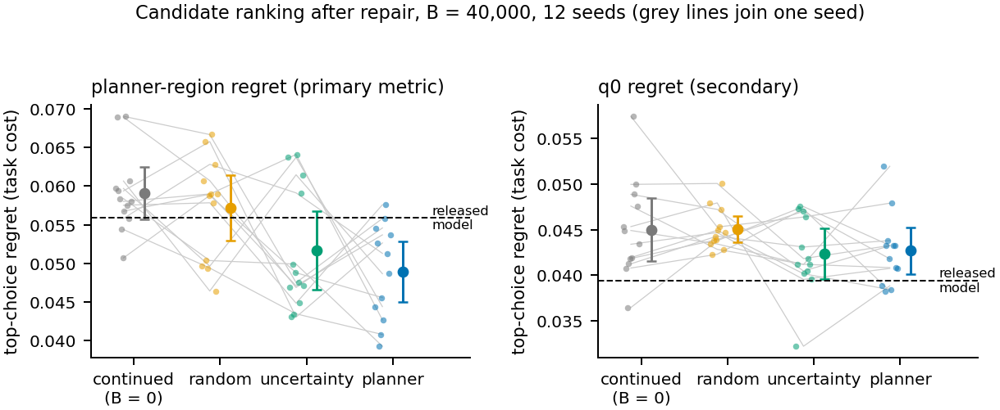
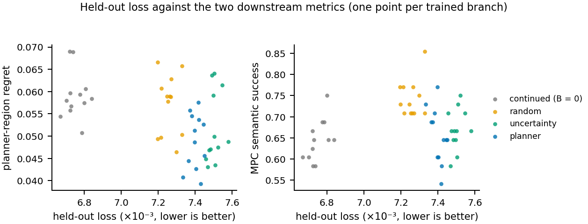
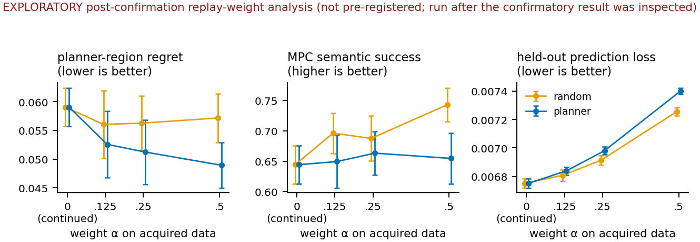

# Planner Atlas: report

**Status.** Final, 2026-09-30. This report covers the whole project in the order the work was
done: the question, the system, every experiment, the two later studies that were closed, what
survived, and what was corrected along the way. It replaces the earlier report of the confirmatory
experiment (2026-09-22) and includes all of its content; the confirmatory experiment itself is
section 9.

**Sources.**
- Repair-study numbers come from [results/summary.json](results/summary.json). That file is
  computed by `scripts/summarize_results.py` from runs of commit `2d6364d` (tag
  `results-confirm2`).
- Stage-1 means, gate statistics and per-case slopes come from
  [results/optimization_depth_stage1_summary.json](results/optimization_depth_stage1_summary.json).
  It is a byte-identical copy of the Stage-1 analysis output of commit `65d3f00` (tag
  `optimization-depth-stage1-frozen`, sha256 `618e51af…`).
- Stage-1 standard errors, rank bins, the CEM comparison and the geometry come from that run's
  `per_case.jsonl` (sha256 `3644969…`), which stays on local disk.
- Every other number is marked where it appears. These are development measurements, the
  superseded exploratory grid, the E1 session record and recomputations made for this revision.

| document | what it holds |
| --- | --- |
| [README](../README.md) | the project overview, headline results and repository guide |
| [results/optimization_depth_stage1.md](results/optimization_depth_stage1.md) | the complete Stage-1 result |
| [results/scientific_ledger.md](results/scientific_ledger.md) | every claim with its evidence and status |
| [protocols/](protocols/) | pre-registrations, amendments, the evaluation manifest and the replay-weight design note, verbatim |


*The study in one picture.*
1. *The released LeWM world model encodes the start and goal frames and rolls a 5-block plan
   forward in latent space. It scores the plan by the squared distance between the predicted final
   latent and the goal latent. CEM searches for the plan with the lowest predicted cost.*
2. *The plans that search selects are over-optimistic. Their realized latent cost exceeds the
   prediction by far more than a random plan's does. The data are the acquisition streams of the
   confirmatory run: 12 seeds × 1,600 plans per strategy.*
3. *Each strategy's 40,000 transitions repair the dynamics under identical compute. Planner data
   improves the ranking of the planner's own candidates (pre-registered). Random data improves
   closed-loop MPC (secondary).*

## Contents

1. [The short version](#1-the-short-version)
2. [The question](#2-the-question)
3. [The system](#3-the-system)
4. [Timeline](#4-timeline)
5. [The Planner-Exploitation Atlas](#5-the-planner-exploitation-atlas)
6. [Training dynamics on a frozen representation](#6-training-dynamics-on-a-frozen-representation)
7. [What each acquisition strategy collects](#7-what-each-acquisition-strategy-collects)
8. [The exploratory repair grid and the audit that replaced it](#8-the-exploratory-repair-grid-and-the-audit-that-replaced-it)
9. [The confirmatory repair experiment](#9-the-confirmatory-repair-experiment)
10. [Exploratory analyses after confirmation](#10-exploratory-analyses-after-confirmation)
11. [Later study 1: planner-conditioned reliability (E1)](#11-later-study-1-planner-conditioned-reliability-e1)
12. [Later study 2: optimization depth (Stage 1)](#12-later-study-2-optimization-depth-stage-1)
13. [Scientific ledger](#13-scientific-ledger)
14. [Discussion](#14-discussion)
15. [Corrections, audits and known gaps](#15-corrections-audits-and-known-gaps)
16. [Reproducibility](#16-reproducibility)
17. [Glossary](#17-glossary)

## 1. The short version

**The question.** A planner that optimizes through a learned world model chooses the plans the
model scores best. Those are disproportionately plans whose cost the model underestimates. Is the
planner's own experience therefore the best data for repairing the model?

We tested this with the released LeWM latent world model on PushT. Planner-selected data competed
with random and ensemble-uncertainty acquisition under two equal budgets: 40,000 environment
transitions per arm, and 1,000 training steps per repaired model.

**What holds.**

1. **Confirmed, pre-registered.** Repair on planner-selected data made the model rank that
   planner's candidate plans better than repair on random data did.
   - Top-choice regret changed by −0.00826, 95% CI [−0.01176, −0.00476].
   - 11 of 12 independent seeds went in the predicted direction.
   - Exact sign-flip p = 0.0015.
   - The claim is scoped to the matched planner: the released model's CEM at pressure P2.
   - Against uncertainty-selected data, the difference is unresolved: −0.0027 [−0.0102, +0.0047].
2. **Descriptive, in every seed.** Search selects plans that are optimistic, high-error and
   task-relevant. Compared with random acquisition, planner-selected acquisition had:
   - 2.6× the rollout error;
   - signed optimism of +48.4 against +8.8;
   - open-loop semantic success of 0.67 against 0.08.
3. **Secondary, descriptive.** Random data improved closed-loop MPC, and planner data did not.
   Against an equal-compute continued-training control, random data raised semantic success by
   +0.099 (11 of 12 seeds). Planner data raised it by +0.010.
4. **Descriptive.** Held-out prediction loss ordered the repaired models differently from both
   downstream metrics. The branch with the best held-out loss had the worst planner-region
   ranking.

**What was closed.**

- **Transfer to another planner.** The ranking gain did not clearly carry over to another planner
  configuration: −0.0039, p = 0.25 (exploratory).
- **E1, planner-conditioned reliability.** Closed before any outcome was computed. Two pre-declared
  validity gates failed. The two planners compared differ in how deeply they optimize, not in where
  they search.
- **Stage 1, optimization depth.** Pre-registered, and returned NO-GO. With the proposal fixed,
  deeper search raised the chosen plan's latent regret on average, but:
  - the rise was inconsistent across cases: positive in 28 of 48, where the gate needed 34;
  - it was no larger than an exchangeable-error optimizer's-curse null predicts;
  - the chosen plans' true task cost still fell overall.

**The lesson.** In this setting, "better model" depended on the use.
- Planner-targeted data made it more reliable for the planner that chose the data.
- Random data made closed-loop control better.
- Held-out loss registered neither change.

Larger latent-model error under optimization was not the same thing as worse decisions.

## 2. The question

**How these models are used.** Latent world models such as LeWM learn to predict the next latent
state from logged trajectories. They are then used for planning. A sampling-based optimizer
searches for action sequences whose predicted outcome is closest to a goal. The models are usually
judged by held-out one-step prediction loss on the logged distribution.

**Why that judgment can mislead.** A planner does not sample from the logged distribution. It
searches, and search favours whatever the model scores best. If the model's errors vary from plan to
plan, the best-scoring plan tends to be one whose cost the model underestimates. This is the
optimizer's curse, also called regressional Goodhart: pick the best-looking of many noisy estimates
and you systematically pick an overestimate. The errors that matter for planning are the ones the
optimizer selects, and they can be rare in logged data.

**The repair idea.** Pay for simulator interaction on exactly the trajectories the planner chooses,
then retrain on them. The idea is natural, but it has to beat two simpler uses of the same
interaction budget:
- random exploration, which gives broad coverage;
- ensemble-uncertainty selection, the standard active-learning choice.

The project asked three questions, in order:

1. **Atlas.** Does optimization pressure select trajectories with larger, positively signed model
   error?
2. **Acquisition.** What does each acquisition strategy actually collect?
3. **Repair.** Under equal interaction and compute, does planner-selected data repair the model
   better, and better at what?

After the repair result, two later studies asked whether a stronger, more general claim could be
made:

4. **E1.** Is model reliability planner-conditioned, so that repair data from one planner helps
   that planner more than another?
5. **Stage 1.** With the proposal fixed, does deeper search make the model progressively worse at
   choosing the best available plan, beyond the ordinary optimizer's curse?

Both were closed. Sections 11 and 12 report them in full. Section 9.1 explains how they relate to
the confirmatory stopping rule.

## 3. The system

### 3.1 The world model

The project uses the released LeWM checkpoints `quentinll/lewm-pusht` and `quentinll/lewm-tworooms`
on Hugging Face. The reference implementation is `lucas-maes/le-wm`, read at commit `8edfeb3`. The
PushT checkpoint has sha256 `48938400ae3464c9680731287f583a9cb516f55a8ec64ea13a91be47fb15b607`, and
every result row records it.

- **Encoder.** A 224×224 frame passes through a ViT-tiny encoder (CLS token) and a BatchNorm
  projector into a 192-d latent z.
- **Predictor.** A 6-layer causal transformer maps a history of latents and action embeddings to
  the next latent. It keeps the released dropout of 0.1 and ends in a BatchNorm output projection.
- **Actions.** A raw PushT action is 2-d. Actions are z-scored per raw coordinate and packed five at
  a time into a 10-d block, so one block covers 5 simulator steps. A plan is 5 blocks: 25 simulator
  steps, or 50 numbers.
- **Cost.** A plan's predicted cost Ĉ is the squared distance from the predicted fifth latent ẑ₅
  to the goal latent, summed over the 192 dimensions. Its realized cost C is the same sum computed
  with the latent of the frame the simulator actually reached.

### 3.2 Environments and cases

**PushT** is the main environment: an agent disk pushes a T-shaped block to a goal pose. A case
pairs a start state with the recorded state 25 steps later in the same expert episode, which serves
as the goal.

- **Reconstructing a start.** A mid-episode PushT state cannot be set exactly, because the recorded
  state omits the block's velocity and the physics engine's contact cache. Each start is therefore
  rebuilt by restoring the episode's initial state and replaying the recorded actions. In a
  development check over all 18,685 episodes, this matched the recording to about 1e-3 px, except
  for a 0.3% tail of rows that diverge at a contact event.
- **Task cost.** J = block position error / 512 + wrapped angle error / π.
- **Semantic success.** The block is within 20 px and π/9 of its goal pose. These are PushT's own
  tolerances, without the agent-position condition of the environment's official success.
- **Data.** The official PushT expert dataset has 18,685 episodes and 2,336,736 frames.
  - An episode-level split (seed 0) holds out 10%, or 1,868 episodes.
  - Evaluation cases come only from held-out episodes.
  - Acquisition contexts come only from training episodes.

**TwoRoom** is a navigation task between two rooms. It is used only in the Atlas, with 100 cases.

### 3.3 Planners and optimization pressure

Both planners search 5-block plans under a Gaussian proposal over normalized action blocks. Samples
are clamped to the model-space image of the raw action bounds, which is about ±4.76 to ±4.87
depending on the coordinate. The initial proposal q0 is N(0, I).

- **CEM** (the cross-entropy method) samples a population and keeps the best 10% as elites. It
  refits the Gaussian to them, with a minimum standard deviation of 0.05, and repeats. It returns
  the best plan evaluated over all iterations.
- **Random shooting** draws the same total number of plans from q0 in a single round and returns
  the best.

Four pressures give CEM 128×1, 128×2, 256×4 and 512×6 samples × iterations (P0, P1, P2 and P3).
Random shooting at the same pressure draws the same total count in one round, so at P0 the two
planners are identical.

### 3.4 What is measured

| quantity | definition |
| --- | --- |
| optimism O | realized minus predicted latent cost, C − Ĉ. O > 0 means the model thought the plan ended closer to the goal than it did |
| selection amplification | O of the chosen plan minus the mean O of 32 plans drawn from q0 |
| rollout error | mean squared latent error over the 5 predicted blocks. It is a mean over dimensions, so its scale is 192 times smaller than a cost's |
| terminal error | mean squared latent error at the fifth block |
| top-choice regret of a pool | true task cost of the candidate with the lowest predicted cost, minus the lowest true task cost in the pool |
| held-out loss | the training objective (teacher-forced one-step latent MSE) on windows from held-out episodes |

### 3.5 Numerical fidelity

- **Rollout and cost match upstream exactly.** They reproduce upstream's official outputs with
  max |Δ| = 0 for both checkpoints. A negative control that shifts the actions by one step
  differs by 1.5 to 7.0, so the check would catch a misalignment.
- **The encoder is not bitwise identical.** Two things change the result:
  - on Ampere GPUs, cuDNN runs the ViT's patch convolution in TF32, PyTorch's default;
  - the frame tensor is passed non-contiguously, which changes the algorithm cuDNN chooses.

  Latents differ from full-fp32 encoding by up to 4.6e-3. In that check, a plan's cost moved by
  at most 0.09 on costs of about 39.
- **What that means for the results.** They are internally consistent, because every branch of an
  experiment shares the same encoded start, goal and outcome latents. Exact numbers are not
  promised on other hardware.
- **How the checks were done.** These checks were run during development and repeated by an
  external audit. No committed test pins the rollout to upstream; section 15 lists this gap.

## 4. Timeline

| date | commit | step |
| --- | --- | --- |
| 2026-09-19 | `b8a57c7`, `271f6c1` | repository scaffolding (the message of `271f6c1`, "Stage 1 completed", is unrelated to the later Stage-1 study) |
| 2026-09-19 | `2ad7cfe`, `e6e87ba`, `5fe23cd`, `9ea2aa1` | environment boundary, reference LeWM inference, action contract, latent planners |
| 2026-09-19 | `7d62e8c` | TwoRoom Atlas |
| 2026-09-20 | `7a7f75a` | PushT Atlas |
| 2026-09-20 | `2deddc5` | dynamics training and the uncertainty ensemble |
| 2026-09-20 | `2fcb9e7` | acquisition and repair; the exploratory 3-seed grid |
| 2026-09-20 | `2d6364d` | protocol corrections after an audit; the confirmatory code (tag `results-confirm2`) |
| 2026-09-20 to 21 | runs of `2d6364d` | confirmatory experiment (pre-registered), then the exploratory replay-weight analysis |
| 2026-09-22 | `f563e85` | maintenance for future runs (protocol `frozen_rep_v3`); no result regenerated |
| 2026-09-22 | `d83b7b8`, `c9aae44` | documentation and provenance stamp (tag `project-final`) |
| 2026-09-22 to 23 | no commit | E1 validity gates computed and failed; E1 closed |
| 2026-09-23 | `ebdfa8a`, `8b47d24` | Stage-1 pre-registration and its pre-implementation amendment |
| 2026-09-23 | `65d3f00` | Stage-1 implementation (tag `optimization-depth-stage1-frozen`), executed the same day |
| 2026-09-24 | `2f0a5c4` | Stage-1 result and scientific ledger |
| 2026-09-30 | this revision | this report (the confirmatory report extended to the whole project), schematic and Stage-1 figures, documentation corrections |

## 5. The Planner-Exploitation Atlas

*Descriptive.* The Atlas audits the released models without any repair. PushT has 50 cases and
TwoRoom 100. For each case, pressure and planner it records:
- the chosen plan's predicted and realized cost, optimism, rollout and terminal error, and true
  task outcome;
- a 32-plan q0 audit shared by both planners;
- for CEM, a 32-plan audit of its final proposal;
- one block-level MPC episode.


**PushT, 50 cases** (mean ± SE over cases; costs and errors are means):

| | P0 128×1 | P1 128×2 | P2 256×4 | P3 512×6 |
| --- | ---: | ---: | ---: | ---: |
| optimism of CEM's chosen plan | 17.7 ± 4.9 | 32.2 ± 7.7 | 39.9 ± 8.9 | 59.8 ± 12.7 |
| mean optimism of a q0 plan | 7.0 ± 2.5 | 8.1 ± 2.3 | 7.8 ± 2.4 | 8.7 ± 2.4 |
| selection amplification, CEM | 10.6 ± 4.7 | 24.1 ± 7.9 | 32.1 ± 9.5 | 51.1 ± 13.3 |
| selection amplification, random shooting | 10.6 ± 4.7 | 11.7 ± 7.7 | 22.4 ± 5.1 | 19.3 ± 7.5 |
| rollout error, CEM's plan / a q0 plan | 0.056 / 0.042 | 0.087 / 0.044 | 0.099 / 0.045 | 0.128 / 0.041 |
| true task cost, CEM / random shooting | 0.224 / 0.224 | 0.165 / 0.206 | 0.146 / 0.193 | 0.137 / 0.175 |
| open-loop semantic success, CEM | 0.32 | 0.44 | 0.70 | 0.72 |

**TwoRoom, 100 cases:**

| | P0 | P1 | P2 | P3 |
| --- | ---: | ---: | ---: | ---: |
| optimism of CEM's chosen plan | 4.9 ± 3.5 | 13.0 ± 6.5 | 6.9 ± 3.5 | 12.4 ± 5.1 |
| mean optimism of a q0 plan | −13.2 ± 1.6 | −13.4 ± 1.4 | −13.0 ± 1.5 | −13.4 ± 1.5 |
| selection amplification, CEM | 18.1 ± 3.5 | 26.4 ± 6.6 | 19.9 ± 3.8 | 25.9 ± 5.4 |
| selection amplification, random shooting | 18.1 ± 3.5 | 12.9 ± 3.5 | 20.3 ± 4.4 | 23.9 ± 4.7 |
| MPC success of CEM (the environment's success flag) | 0.68 | 0.81 | 0.82 | 0.86 |

**Reading.**

- **PushT.** More pressure buys better plans and increasingly optimistic errors.
  - CEM's task cost falls from 0.224 to 0.137, and its open-loop semantic success rises from 0.32
    to 0.72.
  - Amplification rises about fivefold.
  - At P3, the chosen plan's rollout error is about three times a typical proposal's (0.128
    against 0.041).
  - From P1 up, CEM amplifies more than random shooting at an equal sample count.
- **TwoRoom.** Amplification is positive at every pressure but shows no trend. A typical proposal is
  pessimistic there (mean q0 optimism about −13). The chosen plan's positive optimism (+5 to +13)
  is therefore amplification relative to a pessimistic baseline, not large absolute
  over-optimism.

**Caveats.**

- **Provenance.** The Atlas predates the repair protocol. It ran on the code of commits `7a7f75a`
  (PushT) and `7d62e8c` (TwoRoom). Its rows carry no commit stamp, and it encodes goals from their
  recorded dataset frames.
- **What it shows.** It is descriptive. It shows that chosen plans are more optimistic than typical
  ones. It does not show that the effect exceeds what best-of-N selection alone produces.
- **What Stage 1 adds.** Stage 1 later tested one form of that question, for random shooting over
  a fixed proposal. It asked whether decision regret grows with search faster than an
  exchangeable-error null predicts, and found no such excess (section 12). It did not test CEM
  pressure, so it qualifies how the Atlas is read without refuting it.

## 6. Training dynamics on a frozen representation

Every repaired model in this project trains only the dynamics: the action encoder, the predictor
and the predictor's output projection. The representation (the image encoder and its projector) is
frozen in eval mode.

- **Objective.** Upstream's, from le-wm `8edfeb3`: a teacher-forced one-step latent MSE over windows
  of 4 observations spaced 5 raw steps apart. From each of the first 3 latents and its action
  block, the causal predictor predicts the next latent.
- **SIGReg is omitted.** Upstream adds 0.09 × SIGReg of the embeddings to prevent representation
  collapse. With the encoder frozen, that term's input is constant, so its gradient with respect to
  every trainable parameter is exactly zero.
- **BatchNorm.** The predictor projection's BatchNorm keeps the released running statistics while
  its affine parameters train. Otherwise a normalization layer adapting to each branch's data would
  act as a second, distribution-dependent repair mechanism.
- **Dropout** stays live in training, so training seeds both torch and the window sampler.
- **Latents.** Training latents are live renders of the replayed dataset, from the same renderer
  that planning and evaluation use. Recorded dataset pixels sit about 0.7 latent L2 from the live
  render of the same state (a development measurement).
- **Protocol label.** The confirmatory runs used the dynamics protocol labelled `frozen_rep_v2`:
  frozen representation, held normalization statistics. The superseded exploratory grid (section 8)
  carried the same label with recorded-pixel latents.
- **Development note, not in the committed summary.** The released checkpoints are accurate only in
  eval mode. With train-mode dropout and batch-statistics BatchNorm, the PushT held-out loss is
  roughly 70 times higher. This is one reason the protocol holds the running statistics fixed.

**Uncertainty ensemble.**
- *Members.* Five, each the released checkpoint trained for one epoch (13,947 steps of batch
  128) on an independent bootstrap of the 1,785,252 training windows.
- *Effect.* This lowers held-out loss from 0.00997 to between 0.0058 and 0.0059 (a development
  measurement, not in the committed summary).
- *Score.* A plan's uncertainty is the population variance of its predicted goal cost across the
  five members.

## 7. What each acquisition strategy collects

*Descriptive.* Each seed samples a fixed pool of 1,600 training-split contexts, each a start and a
goal. Every strategy walks the pool in the same permuted order. For each context, a strategy
chooses one 5-block plan using only pre-execution information, then pays 25 simulator transitions to
execute it. That is 1,600 × 25 = 40,000 transitions per stream.

- **random**: one plan drawn from q0.
- **uncertainty**: of 128 q0 plans, the one with the largest ensemble variance of predicted goal
  cost. Random and uncertainty draw from the same per-context generator.
- **planner**: the plan returned by P2 CEM (256 × 4) with the released model.

The strategies faced identical contexts in every seed; this was checked from the stream records.



| 12 seeds × 1,600 plans; mean [range over seeds] | random | uncertainty | planner |
| --- | ---: | ---: | ---: |
| signed optimism | +8.8 [7.9, 9.8] | +18.9 [16.2, 22.1] | +48.4 [44.7, 52.7] |
| absolute optimism | 20.3 [19.5, 21.3] | 51.3 [49.2, 53.4] | 50.8 [47.3, 55.1] |
| rollout error | 0.0468 [0.0423, 0.0512] | 0.1299 [0.1240, 0.1405] | 0.1227 [0.1145, 0.1314] |
| terminal error | 0.0796 [0.0722, 0.0878] | 0.2659 [0.2537, 0.2896] | 0.2673 [0.2478, 0.2887] |
| true task cost | 0.269 [0.261, 0.277] | 0.245 [0.240, 0.253] | 0.105 [0.098, 0.112] |
| semantic success (open loop) | 0.08 [0.07, 0.09] | 0.17 [0.15, 0.18] | 0.67 [0.64, 0.69] |

- **Both targeted strategies find high-error regions.** Relative to random acquisition,
  uncertainty and planner selection have 2.8× and 2.6× the rollout error, and 3.3× and 3.4× the
  terminal error.
- **Their errors differ in sign.** The ratio of signed to absolute optimism is 0.37 for uncertainty
  and 0.95 for the planner, so the planner's errors are almost all optimistic.
- **The planner's plans make by far the most task progress.** They succeed open loop 67% of the
  time, against 17% for the uncertain plans and 8% for the random ones.
- **The orderings are robust.** The seed ranges of planner and random never overlap, so every
  planner-vs-random ordering in the table holds in all 12 seeds.

Uncertainty selection is therefore a working baseline that collects a different kind of data, not a
failed one.

## 8. The exploratory repair grid and the audit that replaced it

The first repair experiment, at commit `2fcb9e7`, ran 3 seeds (0 to 2) at budgets of 2,500, 10,000
and 40,000 transitions. Planner − random planner-region regret was +0.0052, −0.0013 and −0.0147
at the three budgets. These values come from that grid's own rows, not from the committed summary.

An audit of that grid found four defects:
1. dropout in repair was unseeded, so branches were not reproducible;
2. training latents came from recorded dataset pixels rather than live renders;
3. an off-by-one error dropped one repair window per trajectory;
4. held-out loss used a prefix of the held-out split that covered only 196 episodes.

All four were fixed in `2d6364d` before the amendment was registered. The grid is superseded for
inference, but two things from it still matter:
- **Winner's curse.** Its 40,000-transition estimate (−0.0147) is about 1.8 times the confirmed
  effect (−0.00826). That is what the winner's curse predicts for an estimate that motivated its
  own confirmation.
- **No budget curve.** The smaller budgets were never rerun under the corrected protocol, so no
  budget curve is established.

## 9. The confirmatory repair experiment

### 9.1 Protocol

*Confirmatory.* The protocol was pre-registered before any confirmatory branch was trained.

| step | when | artifact (sha256) |
| --- | --- | --- |
| protocol registered: hypothesis, metric, seeds, analysis, stopping rule | 2026-09-20, before any confirmatory branch | [confirmatory-protocol.md](protocols/confirmatory-protocol.md) (`b05621fe…`) |
| code fixed: seeded dropout, live-render latents, corrected repair windows, random held-out subsample | 2026-09-20 22:18 | commit `2d6364d` |
| amendment 1: fresh manifest (seed 307), seeds 4 to 15 | 2026-09-20 23:09 | [confirmatory-amendment-1.md](protocols/confirmatory-amendment-1.md) (`32d69d8d…`) |
| frozen manifest | 2026-09-20 | [confirmatory-manifest.json](protocols/confirmatory-manifest.json) (`5e945883…`) |
| acquisition: 36 streams | 2026-09-20 23:10 to 09-21 01:15 | streams record commit `2d6364d` |
| repair and evaluation: 49 branches × 48 cases | 2026-09-21 01:19 to 03:02 | `grid.jsonl`, 2,352 rows, commit and digests in every row |

**Amendment.** The protocol-correction pass between registration and launch forced one amendment:
- the original manifest (`86ed349f…`) had been consumed by a one-seed protocol-validation run whose
  results were inspected;
- seed 3 had been observed in a smoke run.

The amendment fixed a fresh manifest (seed 307) and fresh seeds 4 to 15. Everything else was
unchanged: the hypothesis, the primary metric, the seed as the unit, the branch set, the training
and planner settings, and the analysis plan.

**Hypothesis.** At B = 40,000 transitions, planner-selected acquisition gives lower planner-region
top-choice regret than random acquisition after identical repair compute.

**Stopping rule.** "No follow-up study (in particular no replay-mixture study) is launched from this
experiment."
- The replay-weight analysis (section 10.2) broke this rule directly. It extended the confirmatory
  branches after their result was inspected, and it is labelled exploratory.
- The two later studies (sections 11 and 12) asked new questions. Each had its own pre-declared
  gates or pre-registration. Neither retrained nor re-analysed a confirmatory branch, although
  Stage 1 reused the consumed evaluation manifest.
- Whether the later studies count as follow-ups under this rule is a judgment call. They are
  reported in full either way.

### 9.2 Design

- **Seeds.** 12 seeds, 4 to 15. Each seed is an independent acquisition stream and repair run, and
  its training seed equals its stream seed.
- **Branches.** Each seed has four: continued (B = 0), random, uncertainty and planner. With the
  released model as a shared reference, that makes 49 branches.
- **Repair.**
  - Every branch starts from the released checkpoint and takes 1,000 AdamW steps: lr 5e-5, weight
    decay 1e-3, gradient clip 1.0, batch 128.
  - Branches with B > 0 draw 64 base training windows and 64 acquired windows per batch, both with
    replacement.
  - A 5-block trajectory yields 3 windows, so the 4,800 acquired windows are each seen about 13
    times.
  - The continued control takes the same steps on base windows only.
  - The branches differ only in which transitions exist.
- **Evaluation cases.** A frozen manifest of 48 cases from 48 distinct held-out episodes. Two
  candidate pools per case are executed once and shared by every branch:
  - the **q0 pool**, 32 plans from the initial proposal;
  - the **planner-region pool**, 32 plans sampled from the final proposal of the released model's
    P2 CEM.
- **Evaluation metrics.** Besides regret on the two pools, each branch is scored on:
  - its own P3 CEM plan, executed open loop;
  - one MPC episode: P3 CEM, replanning every block, at most 50 raw steps, stopping at semantic
    success;
  - held-out loss on 20,000 windows (seed 909) from 1,867 held-out episodes.
- **Scale.** 49 branches × 48 cases = 2,352 result rows. Every row records the commit, the protocol
  amendment's digest, the manifest and the checkpoint.
- **Inference.** The seed is the unit. A contrast is the vector of 12 per-seed differences of case
  means.
  - The pre-registered test is the exact two-sided sign-flip permutation test over all 2¹² sign
    assignments.
  - Reported beside it: the mean, SD and SE; a 95% t interval (t₀.₉₇₅,₁₁ = 2.201); the paired
    t-test; the exact Wilcoxon signed-rank test; Cohen's d_z; and the count of seeds with each sign.
  - Secondary contrasts carry no multiplicity correction and are descriptive.

### 9.3 Primary result



| per-seed planner − random planner-region regret | |
| --- | --- |
| seeds 4 to 15 | −0.00523, −0.00611, −0.01309, −0.01106, −0.00858, −0.01320, −0.01623, −0.01084, −0.00025, −0.01150, +0.00224, −0.00528 |
| mean, SD, SE | −0.008261, 0.005504, 0.001589 |
| 95% CI | [−0.011759, −0.004764] |
| **exact sign-flip test (pre-registered)** | **p = 0.0015** (6 of 4,096 assignments) |
| paired t-test (supplementary) | t(11) = −5.199, p = 0.0003 |
| exact Wilcoxon signed-rank (supplementary) | p = 0.0015 |
| Cohen's d_z | −1.501 |
| seeds with the predicted sign | 11 of 12 |

**The pre-registered hypothesis is supported.** The effect is a 14% reduction of the random
branch's planner-region regret, from 0.0572 to 0.0489.

### 9.4 Every branch



Branch means over 12 seeds, with 95% t intervals over seeds. The released model is a single
deterministic reference. "Own P3 plan" is the plan the branch's own P3 CEM chooses.

| metric | released | continued | random | uncertainty | planner |
| --- | ---: | ---: | ---: | ---: | ---: |
| planner-region regret (primary) | 0.0559 | 0.0591 [0.0557, 0.0625] | 0.0572 [0.0529, 0.0614] | 0.0517 [0.0466, 0.0568] | 0.0489 [0.0450, 0.0529] |
| q0 regret | 0.0394 | 0.0450 [0.0415, 0.0484] | 0.0451 [0.0436, 0.0465] | 0.0423 [0.0395, 0.0451] | 0.0427 [0.0401, 0.0452] |
| MPC semantic success | 0.625 | 0.644 [0.613, 0.675] | 0.743 [0.715, 0.771] | 0.670 [0.639, 0.701] | 0.655 [0.613, 0.696] |
| own P3 plan: true task cost | 0.0934 | 0.0953 [0.0882, 0.1024] | 0.0938 [0.0875, 0.1000] | 0.0913 [0.0840, 0.0985] | 0.0899 [0.0839, 0.0958] |
| own P3 plan: semantic success | 0.708 | 0.696 [0.676, 0.716] | 0.733 [0.706, 0.760] | 0.727 [0.703, 0.752] | 0.759 [0.720, 0.797] |
| own P3 plan: absolute optimism | 62.3 | 54.3 [50.0, 58.5] | 54.5 [50.0, 59.0] | 49.2 [45.1, 53.4] | 46.4 [42.2, 50.6] |
| own P3 plan: signed optimism | 61.7 | 53.4 [49.2, 57.5] | 53.6 [49.3, 57.8] | 48.3 [43.8, 52.8] | 45.5 [41.2, 49.8] |
| own P3 plan: rollout error | 0.1414 | 0.1223 [0.1113, 0.1333] | 0.1208 [0.1105, 0.1311] | 0.1159 [0.1034, 0.1284] | 0.1026 [0.0947, 0.1105] |
| own P3 plan: terminal error | 0.3343 | 0.2802 [0.2560, 0.3044] | 0.2822 [0.2612, 0.3032] | 0.2614 [0.2391, 0.2837] | 0.2414 [0.2189, 0.2639] |
| held-out loss | 0.00989 | 0.00675 [0.00672, 0.00678] | 0.00726 [0.00723, 0.00729] | 0.00750 [0.00748, 0.00752] | 0.00740 [0.00738, 0.00742] |

### 9.5 Paired contrasts

The values are the mean [95% CI] over seeds and the exact sign-flip p, uncorrected. Only the first
cell of the first row is confirmatory.

| metric | planner − random | planner − continued | random − continued | uncertainty − continued | planner − uncertainty |
| --- | ---: | ---: | ---: | ---: | ---: |
| planner-region regret | **−0.0083 [−0.0118, −0.0048], p = 0.0015** | −0.0102 [−0.0138, −0.0065], p = 0.0010 | −0.0019 [−0.0065, +0.0027], p = 0.38 | −0.0074 [−0.0138, −0.0011], p = 0.029 | −0.0027 [−0.0102, +0.0047], p = 0.43 |
| q0 regret | −0.0024 [−0.0053, +0.0006], p = 0.11 | −0.0023 [−0.0057, +0.0011], p = 0.18 | +0.0001 [−0.0030, +0.0032], p = 0.97 | −0.0027 [−0.0074, +0.0021], p = 0.23 | +0.0004 [−0.0030, +0.0037], p = 0.81 |
| MPC semantic success | −0.089 [−0.132, −0.046], p = 0.0020 | +0.010 [−0.050, +0.071], p = 0.76 | +0.099 [+0.056, +0.142], p = 0.0015 | +0.026 [−0.016, +0.068], p = 0.23 | −0.016 [−0.056, +0.025], p = 0.51 |
| own P3 plan: true task cost | −0.0039 [−0.0109, +0.0031], p = 0.25 | −0.0055 [−0.0098, −0.0011], p = 0.017 | −0.0016 [−0.0104, +0.0073], p = 0.71 | −0.0041 [−0.0149, +0.0068], p = 0.42 | −0.0014 [−0.0113, +0.0085], p = 0.76 |
| own P3 plan: absolute optimism | −8.1 [−13.2, −3.1], p = 0.0049 | −7.9 [−14.6, −1.2], p = 0.028 | +0.2 [−7.1, +7.6], p = 0.94 | −5.1 [−11.1, +0.9], p = 0.088 | −2.8 [−8.2, +2.6], p = 0.27 |
| own P3 plan: rollout error | −0.0182 [−0.0310, −0.0054], p = 0.011 | −0.0197 [−0.0351, −0.0043], p = 0.013 | −0.0015 [−0.0184, +0.0155], p = 0.85 | −0.0064 [−0.0203, +0.0074], p = 0.35 | −0.0133 [−0.0269, +0.0004], p = 0.053 |
| held-out loss | +0.00014 [+0.00013, +0.00016], p = 0.0005 | +0.00065 [+0.00063, +0.00067], p = 0.0005 | +0.00051 [+0.00048, +0.00053], p = 0.0005 | +0.00075 [+0.00072, +0.00079], p = 0.0005 | −0.00010 [−0.00013, −0.00007], p = 0.0005 |

### 9.6 What the result means, and what it does not

**Scope.** The planner stream and the planner-region pool come from the same planner configuration,
the released model's P2 CEM. The stream was generated at training-split contexts and the pool at
held-out cases. The confirmed statement is therefore:

> Training on trajectories selected by a given planner improves candidate ranking on trajectories
> generated by that same planner, relative to random acquisition.

It does not show that planner-targeted repair generally improves decision-relevant reliability.

**What the "planner region" is.** E1's diagnostics (section 11) measured the proposal that the
planner-region pool is drawn from:
- its variance is 0.68 of q0's;
- its mean sits about 0.64 q0 standard deviations per coordinate from q0's.

So the pool covers a shifted but still broad region of action space, not a tight cluster of
near-identical plans. These values were computed in-session and are not stored on disk.

**Secondary results, descriptively.**

- **Ranking.**
  - Planner data also beats the continued control on planner-region regret.
  - Uncertainty data sits between random and planner, and planner − uncertainty is unresolved.
  - Beyond the top choice, whole-pool ranking agrees: the pairwise rank agreement (Goodman and
    Kruskal's gamma) between predicted cost and true task cost in the planner-region pool rose by
    +0.014 [+0.004, +0.024] for planner over random data (p = 0.011).
  - On q0 candidates, no strategy clearly differs on regret.
- **Control.**
  - Random data raises MPC semantic success by +0.099 over the continued control (11 of 12 seeds).
  - Planner data produces no clear change: +0.010, with a CI spanning zero.
  - The planner − random MPC gap (−0.089) is random's gain, not a planner deficit. It does not show
    that planner repair hurts control.
- **Exploitability.**
  - Planner repair lowers the optimism and error of the plan that the repaired model's own P3
    planner chooses (absolute optimism −8.1 against random), so that optimizer finds less
    exploitable error.
  - The true task cost of that plan does not clearly improve against random (section 10.1).

### 9.7 Held-out loss does not track usefulness



- **Three metrics, three orders.**

  | metric | order of the repaired branches, best first |
  | --- | --- |
  | held-out loss | continued, random, planner, uncertainty |
  | planner-region regret | planner, uncertainty, random, continued |
  | MPC semantic success | random, uncertainty, planner, continued |

- **Every repair branch has worse held-out loss than the continued control, in 12 of 12 seeds.**
  This is consistent with acquired windows taking half of every batch that the control spends on
  base windows.
- **The branch with the best held-out loss (continued) has the worst mean planner-region regret.**
- **The released model has the worst held-out loss of all,** 0.00989. Part of that gap is a domain
  shift. The released model was trained on recorded dataset pixels, while held-out loss here is
  measured on live renders. The shift is not the whole explanation, though:
  - The superseded exploratory grid (section 8) measured held-out loss on recorded-pixel latents,
    over a smaller held-out sample. There, the released model scored 0.0083 and the three continued
    branches 0.0056 to 0.0057. These values come from that grid's rows, not from the committed
    summary.
  - So continued training improves the loss on the released model's own domain too.
- **Yet the released model's regret is no worse than the continued branches' mean:** 0.0559 against
  0.0591 on the planner region, and 0.0394 against 0.0450 on q0.

Held-out prediction loss is therefore not a sufficient scalar measure of a world model's usefulness
to a planner.

### 9.8 Limitations of the repair study

- **Matched planner.** The confirmed ranking gain is measured on candidates from the planner
  configuration that also selected the repair data. The one cross-planner check is unresolved
  (section 10.1).
- **Scale.** The study covers:
  - one environment, PushT;
  - one budget, 40,000 transitions;
  - one confirmatory mixture, 50/50;
  - one repair length, 1,000 steps.

  All models share a frozen representation and one model family, and the planners are CEM
  variants.
- **Uncertainty baseline.** One ensemble construction was used: 5 bootstrap members after one
  epoch, scored by cost variance. Planner against uncertainty on the primary metric is unresolved.
- **Evaluation size.** There are 48 cases per branch and one MPC episode per case, so MPC success
  moves in steps of 1/48 per seed.
- **Goal encoding.** The confirmatory and replay runs encoded each goal from its recorded dataset
  frame.
  - That frame sits 0.69 latent L2 from the live-render manifold used everywhere else, averaged
    over the 48 cases.
  - The shift changes a case's start-to-goal cost by 1.3% on average and by at most 9.4%.
  - Every branch shares it, and so does acquisition.
  - The values were measured when the project was finalized and are not in the committed summary.
  - `f563e85` (`frozen_rep_v3`) fixes goal rendering for future runs, but nothing was rerun with it.
- **Status of the control results.** MPC and held-out loss are pre-registered secondary
  descriptives. The replay-weight and coverage analyses are exploratory.

## 10. Exploratory analyses after confirmation

### 10.1 Cross-planner check

*Exploratory.* The own-plan evaluation differs from the planner-region pool in two ways:
- its candidates come from the repaired model rather than the released one;
- its pressure is higher: P3 (512×6) against P2 (256×4).

Its true task cost was not among the pre-registered metrics.

Planner − random own-plan task cost is −0.0039, 95% CI [−0.0109, +0.0031], 9 of 12 seeds, exact
sign-flip p = 0.25 (t-test p = 0.24). This is smaller than the matched-planner effect and
statistically unresolved, so generalization across planners is not established.

### 10.2 Post-confirmation replay-weight analysis

> This analysis was conducted after completion and inspection of the preregistered confirmatory
> experiment and therefore deviates from the preregistered stopping rule.

It is exploratory and was not pre-registered. A design note
([replay-weight-protocol.md](protocols/replay-weight-protocol.md), `5e7d7dd6…`) was recorded before
its branches were trained.

- **Design.**
  - The weight α on acquired data took the values 0.125 and 0.25, which is 16 or 32 of 128 windows
    per batch.
  - Random and planner streams were used for seeds 4 to 15, giving 48 new branches with the same
    code, manifest, pools and settings.
  - α = 0 reuses the continued control, and α = 0.5 reuses the confirmatory branches.
- **Integrity.** The replay rows record commit `2d6364d`, and their shared pools are identical to
  the confirmatory ones. One branch was rerun from scratch as a determinism check and reproduced
  its 48 rows bit for bit.



| mean [95% CI over 12 seeds] | α = 0 (continued) | 0.125 | 0.25 | 0.5 |
| --- | ---: | ---: | ---: | ---: |
| planner: planner-region regret | 0.0591 [0.0557, 0.0625] | 0.0526 [0.0467, 0.0584] | 0.0512 [0.0456, 0.0569] | 0.0489 [0.0450, 0.0529] |
| random: planner-region regret | 0.0591 [0.0557, 0.0625] | 0.0561 [0.0501, 0.0620] | 0.0563 [0.0515, 0.0611] | 0.0572 [0.0529, 0.0614] |
| planner: MPC semantic success | 0.644 [0.613, 0.675] | 0.649 [0.606, 0.693] | 0.663 [0.627, 0.699] | 0.655 [0.613, 0.696] |
| random: MPC semantic success | 0.644 [0.613, 0.675] | 0.696 [0.663, 0.729] | 0.688 [0.650, 0.725] | 0.743 [0.715, 0.771] |
| planner: held-out loss | 0.00675 | 0.00684 | 0.00698 | 0.00740 |
| random: held-out loss | 0.00675 | 0.00681 | 0.00691 | 0.00726 |

| within seed, against continued | α = 0.125 | 0.25 | 0.5 |
| --- | ---: | ---: | ---: |
| planner: Δ planner-region regret | −0.0065 [−0.0127, −0.0003] | −0.0079 [−0.0129, −0.0028] | −0.0102 [−0.0138, −0.0065] |
| planner: Δ MPC semantic success | +0.005 [−0.048, +0.058] | +0.019 [−0.020, +0.058] | +0.010 [−0.050, +0.071] |
| random: Δ planner-region regret | −0.0030 [−0.0099, +0.0038] | −0.0028 [−0.0084, +0.0028] | −0.0019 [−0.0065, +0.0027] |
| random: Δ MPC semantic success | +0.052 [+0.004, +0.100] | +0.043 [+0.005, +0.082] | +0.099 [+0.056, +0.142] |

- **Planner-data weight** steadily improves planner-region ranking and leaves MPC near the continued
  control's level at every α.
- **Random-data weight** leaves planner-region ranking roughly flat and improves MPC. The rise is not
  strictly monotone: 0.696 at α = 0.125 and 0.688 at 0.25.
- **Held-out loss rises with α for both strategies.**
  - Every step from α = 0.125 upward increases it in 12 of 12 seeds.
  - The step from 0 to 0.125 increases it in 12 of 12 planner seeds and 10 of 12 random seeds.
- **Planner vs random differs clearly only at α = 0.5.** At 0.125 and 0.25, the regret differences
  are −0.0035 (p = 0.24) and −0.0051 (p = 0.11).

**What this does not support.** A specialization-versus-forgetting trade-off predicts that lowering
the planner-data weight recovers control as held-out loss recovers. Held-out loss does recover, but
planner MPC stays level, so that explanation is not supported. There was also no planner control
deficit to recover: the planner branches never differ from the continued control on MPC.

### 10.3 Coverage of the acquired data

*Exploratory, descriptive.* This compares the random and planner streams with 100,000
training-split latents of the live cache, drawn with rng seed 0. Values are mean ± SE over 12 seeds.

| | random | planner |
| --- | ---: | ---: |
| true task cost / semantic success | 0.269 / 0.08 | 0.105 / 0.67 |
| latent total variance (covariance trace), blocks 0 to 5 | 191.8 ± 0.1 | 185.2 ± 0.1 |
| participation ratio, blocks 0 to 5 | 78.7 ± 0.2 | 82.7 ± 0.2 |
| distance to the nearest base latent, blocks 1 to 5 | 2.84 ± 0.01 | 2.64 ± 0.01 |
| Mahalanobis distance to the base, blocks 1 to 5 | 14.22 ± 0.01 | 13.75 ± 0.01 |
| nearest-base distance at block 1 and at block 5 | 2.16 and 3.33 | 1.93 and 3.11 |

- **Convention.** The two spread statistics include the start latent (block 0), which the random
  and planner streams share context by context. The two distance statistics exclude it.
  - The earlier report stated that every row excluded the start. That was wrong for the two spread
    rows, and it has been corrected (section 15).
  - Recomputed without the start from the stored acquisition streams (on 2026-09-30; not in the
    committed summary), total variance is 192.1 for random against 184.2 for planner (−4.1%
    instead of −3.4%).
  - The participation ratio becomes 78.3 against 81.7 (+4.4% instead of +5.0%).
  - The direction holds in 12 of 12 seeds either way.
- **Reading.** Planner data is much more task-concentrated, but it is not obviously narrower: its
  total variance is 3% to 4% lower and its participation ratio 4% to 5% higher. It lies
  somewhat closer to the base (expert) distribution than random data does, and random data drifts
  further off-manifold at every block.
- **Hypothesis, untested.** Random exploration may cover off-nominal and recovery states that MPC
  needs after its own deviations. No experiment here tests this, so it is not a result.

## 11. Later study 1: planner-conditioned reliability (E1)

*Closed at its validity gates, before any outcome.*

**The idea.** If a model's reliability is planner-conditioned, then repair data from planner A
should help planner A's decisions more than planner B's. E1 proposed a matched/cross matrix with two
planners at matched compute:
- CEM-P2: 256 × 4 = 1,024 model evaluations;
- random shooting with 1,024 samples (RS-1024).

Both used the same horizon, objective, initial proposal and action bounds. The design called for
fresh seeds and a fresh manifest, a continued control, a random-acquisition arm and a pre-registered
interaction test.

**Validity gates came first.** Before any repair or outcome, the design had to show that the two
planners actually query different parts of action space; otherwise a matched/cross contrast would
be uninformative. Two instruments were declared, each with its threshold fixed before computing.
Both were computed outcome-free, with the base model only, on the already-consumed manifest (seed
307).

1. **Proposal gate.** This measured the overlap of the distributions the two planners draw from:
   q0 for RS-1024, and the final refit proposal for CEM-P2.
   - *Statistic.* The dimension-normalized Bhattacharyya coefficient BC^(1/D) over the D = 50
     action coordinates.
   - *Pass condition.* Median ≤ 0.88, which is e^(−1/8): the overlap of two unit Gaussians 1 SD
     apart in every coordinate.
   - *Result.* Median 0.909, with quartiles 0.900 and 0.923. **Failed.** A second condition (at
     least 75% of cases at ≤ 0.94) passed, at 95.8%.
2. **Decision-set gate.** This measured the separation of the two planners' top-32 plans, their
   decision sets.
   - *Statistic.* The normalized energy distance (NED), with exact candidate overlap as a second
     condition.
   - *Pass condition.* Median NED ≥ 0.10 and median overlap ≤ 0.25.
   - *Result.* Median NED 0.0995 (quartiles 0.067 and 0.133), median overlap 0. **Failed** on NED,
     by 0.0005. The miss was not rounded away.

**Why they failed.** Both instruments point to one fact: in a 50-d action space, the two planners
differ in how deeply they optimize, not in where they search.
- *Neither decision set forms a separate cluster.* On a scale where two independent q0 draws sit
  1.0 apart, RS-1024's top 32 plans sit 0.98 apart and CEM-P2's 0.86. The cross-set distance, 0.96,
  lies between the two, so the sets interleave.
- *What does separate them is candidate quality.* The median predicted cost of the selected plan
  was 64.9 for RS-1024 against 9.8 for CEM-P2.
- *So the axis measured search depth.* A matched/cross experiment on this axis would mostly
  contrast search depth. That is the question Stage 1 then asked directly.

**A side finding.** CEM-P2's final proposal barely contracts: its variance is 0.68 of q0's, a
per-coordinate SD of about 0.83. That proposal is also where the confirmatory planner-region pool
comes from (section 9.6).

**The record.**
- E1 left no files. The gate calculations ran in-session, and their values survive only in the
  scientific ledger and the session record.
- The calculations were deterministic and outcome-free, so they could be recomputed. A
  recomputation would be a reconstruction, though, not the original record.
- E1 was closed without a pre-registration and without a rescue attempt.

## 12. Later study 2: optimization depth (Stage 1)

*Pre-registered go/no-go study. Verdict: **NO-GO**, G1 failed.* The complete result is in
[results/optimization_depth_stage1.md](results/optimization_depth_stage1.md) and the frozen protocol
in [protocols/optimization_depth_stage1.md](protocols/optimization_depth_stage1.md) (`c87b34ac…`).


*The figure has three panels:*
- *(a) Mean latent regret of the chosen plan over 48 cases, against the mean of the
  exchangeable-error null. The shaded band is the N range the gates use.*
- *(b) Mean true task cost of the chosen plan and of the best plan in the pool.*
- *(c) The per-case slope that gate G1 tested, with its mean and 95% CI. Blue marks positive
  slopes.*

### 12.1 The question

- **Primary.** With the candidate proposal fixed, does increasing search depth make the world model
  progressively less reliable at selecting the best available decision?
- **Secondary.** Does any such degradation exceed what an ordinary exchangeable-error optimizer's
  curse produces?
- **Task relevance.** Does the same degradation appear in true PushT task ranking, not only in the
  latent planning objective?

**Why optimism is not the endpoint.** Under best-of-N selection, the expected optimism of the chosen
candidate rises with N as a matter of order statistics. So rising optimism was treated as a sanity
check, not a gate.

### 12.2 Design

- **Cases and model.** The 48 cases of the consumed manifest (seed 307) and the released checkpoint,
  unchanged. There was no retraining, and goals were rendered live (protocol `frozen_rep_v3`).
- **Uncertainty analysis dropped.** The ensemble is `frozen_rep_v2`, and neither a compatibility
  shim nor retraining was allowed, so this omission was recorded in the protocol.
- **One immutable bank per case.** Each case gets 4,096 plans drawn i.i.d. from q0, seeded
  20260923 + case index.
  - Every random-shooting condition RS-N is a prefix of that bank, with N from 32 to 4,096.
  - The primary range is N = 256 to 4,096.
- **Every candidate executed once.** That is 48 × 4,096 bank plans. For the secondary analysis,
  each case also has one 6-iteration CEM trace with a population of 256.
- **Decision reliability.** For prefix N, let î be the candidate with the lowest predicted cost.
  - R_latent(N) = C(î) − min C over the prefix;
  - R_task(N) = J(î) − min J over the prefix.

  Both are regrets, 0 when the model picks the best available plan. J_selected and J_oracle, the
  task costs of the chosen plan and of the best plan, are reported separately.
- **Slopes.** Per case, the OLS slope of each regret on log2 N over N = 256 to 4,096 (5 points).
  The case is the unit, n = 48.
- **Null.** For each case, the observed residuals o = C − Ĉ are permuted across candidates 10,000
  times. Each permutation gives synthetic predictions Ĉ = C − o and a null regret curve.
  - The permutation keeps the bank, the true costs and the residual distribution.
  - It breaks the link between a residual and its candidate.
  - It also does not preserve the variance of the predicted cost, because it removes any
    covariance between C and o. The protocol recorded this caveat in advance: a positive
    covariance makes the null noisier and G2 potentially conservative.

### 12.3 Gates and decision matrix (frozen)

| gate | statistic | pass requires all of |
| --- | --- | --- |
| G1, latent decision reliability | `beta_latent`, slope of R_latent | mean > 0; at least 34 of 48 cases > 0; d_z ≥ 0.5; Monte-Carlo sign-flip p < 0.05 |
| G2, structured exploitation | `excess_beta` = observed slope − mean null slope | mean > 0; at least 32 of 48 > 0; d_z ≥ 0.5; p < 0.05 |
| G3, task relevance | `beta_task`, slope of R_task | mean > 0; at least 29 of 48 > 0; d_z ≥ 0.3 |

**The frozen decision matrix:**
1. All three pass: strong GO, to be followed by an independently pre-registered second-environment
   replication.
2. G1 and G2 pass, G3 fails: default NO-GO for the thesis.
3. G1 passes, G2 fails: NO-GO, since the ordinary optimizer's curse explains the effect.
4. **G1 fails: NO-GO immediately.**
5. All three pass while the chosen plan's task cost still improves: not contradictory. Search stays
   useful while its ranking efficiency degrades.
6. Both regrets fall with N: NO-GO, since deeper search then improves the model's decisions.

A NO-GO is not rescued with another planner, metric, instrument or environment.

**Statistics.**
- The Monte-Carlo sign-flip test uses B = 100,000 draws from one fixed ±1 matrix (seed 20260923),
  with a +1 correction.
- It is reported with its Monte-Carlo SE, and never called exact.
- Supplementary tests are the exact binomial sign test and the exact Wilcoxon signed-rank test.

**The amendment** (`8b47d24`, before implementation) changed no estimand, gate, threshold, ladder
or null. It did four things:
- required all 48 cases, replacing the original rule that allowed a failing case to be dropped;
- pinned the Monte-Carlo sign-flip arithmetic;
- pinned the effect-size, interval and supplementary-test definitions;
- fixed the protocol's determinism check to case 0.

### 12.4 Execution

- **Run.** 2026-09-23, on one RTX 3090. The build took 1 h 41 m, with no failures or retries.
- **Caches.** 48 of 48 random-shooting and 48 of 48 CEM caches are complete.
- **Determinism.** Case 0 was rebuilt, and its caches came out bitwise identical in every dataset
  and metadata key.
- **Deviations.** None.
- **A design property, confirmed.** CEM's first iteration is exactly RS-256, and it selected the
  same candidate in 48 of 48 cases.

### 12.5 Results

**Random shooting over the fixed q0 bank** (mean ± SE over 48 cases; latent costs are sums over 192
dimensions):

| N | predicted C | realized C | signed optimism | R_latent | J_selected | J_oracle | R_task | success |
| ---: | ---: | ---: | ---: | ---: | ---: | ---: | ---: | ---: |
| 32 | 169.2 ± 14.4 | 196.6 ± 16.8 | 27.3 ± 8.4 | 18.5 ± 7.2 | 0.238 ± 0.026 | 0.192 ± 0.022 | 0.046 ± 0.012 | 0.29 |
| 64 | 148.8 ± 14.3 | 169.2 ± 15.8 | 20.4 ± 4.6 | 12.3 ± 4.0 | 0.217 ± 0.025 | 0.166 ± 0.020 | 0.050 ± 0.011 | 0.33 |
| 128 | 134.8 ± 13.9 | 157.5 ± 15.1 | 22.7 ± 5.5 | 18.9 ± 5.7 | 0.202 ± 0.022 | 0.149 ± 0.019 | 0.053 ± 0.010 | 0.35 |
| 256 | 121.2 ± 12.8 | 153.0 ± 15.2 | 31.8 ± 7.1 | 24.0 ± 5.9 | 0.192 ± 0.022 | 0.137 ± 0.018 | 0.055 ± 0.010 | 0.35 |
| 512 | 103.0 ± 11.8 | 147.9 ± 15.9 | 44.9 ± 10.4 | 35.8 ± 9.0 | 0.191 ± 0.025 | 0.119 ± 0.016 | 0.072 ± 0.014 | 0.40 |
| 1024 | 93.3 ± 11.0 | 134.2 ± 15.6 | 40.8 ± 9.7 | 29.4 ± 6.7 | 0.176 ± 0.024 | 0.114 ± 0.016 | 0.062 ± 0.013 | 0.40 |
| 2048 | 77.1 ± 10.4 | 135.6 ± 16.2 | 58.5 ± 12.0 | 44.1 ± 8.4 | 0.178 ± 0.024 | 0.100 ± 0.015 | 0.078 ± 0.014 | 0.42 |
| 4096 | 69.1 ± 10.3 | 119.6 ± 16.2 | 50.5 ± 11.5 | 39.9 ± 7.5 | 0.163 ± 0.024 | 0.086 ± 0.014 | 0.077 ± 0.015 | 0.44 |

**Gates.** Case-level slopes over N = 256 to 4,096 against log2 N, n = 48:

| gate | mean [95% CI] | cases > 0 | d_z | Monte-Carlo sign-flip p (SE) | result |
| --- | --- | --- | --- | --- | --- |
| **G1** `beta_latent` | +4.02 [−0.04, +8.08] | 28 of 48 (needed 34) | 0.29 (needed 0.5) | 0.0513 (0.0007), needed < 0.05 | **FAIL** |
| G2 `excess_beta` | −2.21 [−6.34, +1.93] | 20 of 48 (needed 32) | −0.16 | 0.290 (0.0014) | FAIL |
| G3 `beta_task` | +0.0049 [−0.0012, +0.0110] | 28 of 48 (needed 29) | 0.23 (needed 0.3) | 0.116 (descriptive) | FAIL |

- **Supplementary tests.**
  - G1: exact binomial p 0.028, exact Wilcoxon p 0.050.
  - G2: binomial 0.31, Wilcoxon 0.21.
  - G3: binomial 0.14, Wilcoxon 0.088.
- **G1 fails on three counts.** The verdict does not hinge on the borderline p-value: G1 also fails
  on its case count (28 < 34) and its effect size (0.29 < 0.5).
- **The rise is within what the null produces.** The mean observed slope was +4.02. The mean null
  slope, with the same residuals exchanged across candidates, was +6.23. Descriptively, the
  selected plans' optimism was also below the null's at every N: 50.5 against 101.4 at N = 4,096.
- **A diagnostic, not a gate.** The per-case correlation between true cost and residual, corr(C, o),
  had median +0.175 and was positive in 67% of cases. By the protocol's pre-recorded caveat, this
  makes the null potentially conservative. It did not alter G2.
- **Task curves.** Over N = 256 to 4,096:
  - J_selected fell overall from 0.192 to 0.163, with slope −0.0073 [−0.0135, −0.0010] (not at
    every step: it rose from 0.176 at N = 1,024 to 0.178 at 2,048);
  - J_oracle fell from 0.137 to 0.086;
  - R_task rose from 0.055 to 0.077, with no consistent case-level trend.

  The frozen reading is **D: task regret flat; latent degradation not clearly task-relevant**.

### 12.6 What else Stage 1 showed

These are characterization results, not gates.

- **Optimism concentrates in the predicted-good tail.** This is the one strong effect.
  - The difference between the top 1% and the bottom 50% of the bank by predicted cost is +28.95
    [+20.9, +37.0] in signed optimism, positive in 41 of 48 cases, d_z 1.05.
  - This is the direction ordinary best-of-N selection predicts. The tail difference itself was not
    compared with the null.
- **Selected optimism rises with N,** but the slopes are heterogeneous across cases:
  - signed: +5.10 [+0.07, +10.13], positive in 23 of 48;
  - absolute: +5.08 [+0.19, +9.96], positive in 27 of 48.
- **Rank-conditioned reliability** (the bank sorted by predicted cost, mean over cases):

  | rank bin | signed optimism | rollout error | terminal error | true J | success |
  | --- | ---: | ---: | ---: | ---: | ---: |
  | best 1% | 32.3 | 0.097 | 0.203 | 0.202 | 0.35 |
  | 1% to 5% | 21.1 | 0.074 | 0.149 | 0.240 | 0.26 |
  | 5% to 10% | 15.7 | 0.062 | 0.117 | 0.260 | 0.20 |
  | 10% to 25% | 11.9 | 0.051 | 0.091 | 0.277 | 0.11 |
  | 25% to 50% | 8.5 | 0.042 | 0.071 | 0.293 | 0.06 |
  | worst 50% | 3.3 | 0.040 | 0.066 | 0.311 | 0.03 |

- **CEM against compute-matched random shooting** (secondary). At matched model evaluations, CEM
  reaches much better true task cost. At 1,536 evaluations, CEM's J_selected is 0.081 against RS's
  0.177, a difference of −0.096 ± 0.021. CEM's latent regret is on average larger (+9 to +30, with
  SEs of 10 to 14), and its task regret shows no consistent difference.
- **Geometry** (descriptive). With the proposal fixed, the selected candidate drifts slightly toward
  larger actions:
  - action norm 7.09 to 7.49, about 0.07 bank SD per doubling of N;
  - q0 negative log-density 25.5 to 28.3.

  Latent out-of-distribution indicators stay essentially flat: nearest-base distance 3.38 to 3.49,
  and Mahalanobis distance 13.69 to 13.36.

### 12.7 Verdict and meaning

**Supported.**
- Prediction error and optimism are strongly concentrated in the model's predicted-good tail, as
  ordinary best-of-N selection predicts.
- Deeper fixed-q0 search lowers predicted cost and, on average, somewhat increases selected
  optimism and latent regret.
- That increase is heterogeneous across cases, fails the pre-registered reliability gate (G1), and
  does not exceed the exchangeable-error baseline (G2).
- Task-ranking degradation is not established (G3). Absolute selected task performance improves
  with deeper search.
- Adaptive CEM improves true task performance substantially over compute-matched random shooting,
  even while its latent regret can be larger.

**Not supported.**
- A consistent optimization-depth-induced decision-reliability failure.
- Structured exploitation beyond the ordinary optimizer's curse.
- Task-level harm from deeper search.
- The proposed optimization-depth thesis.

**The distinction to keep.** Larger latent-model error under optimization is not equivalent to
worse downstream decisions. Here, the searches that selected plans with larger latent optimism and
regret also selected plans with better true task outcomes.

**What Stage 1 cannot establish.** It cannot show the absence of an effect. It failed to meet a
pre-registered bar on 48 PushT cases, with one released checkpoint and search over a fixed
proposal. It says nothing about other environments, models or planners.

## 13. Scientific ledger

The full ledger, with evidence, is [results/scientific_ledger.md](results/scientific_ledger.md).

| claim | status | evidence |
| --- | --- | --- |
| Planner-selected repair improves matched-planner (P2) ranking relative to random repair | **confirmed**, pre-registered | −0.00826 [−0.01176, −0.00476], 11 of 12 seeds, p = 0.0015 |
| Optimization selects high-error, optimistic trajectories | descriptive, every seed. Stage 1 found no excess over an exchangeable-error null in how decision regret grows with search (random shooting, fixed proposal) | acquisition streams; Atlas; Stage 1 S3 and G2 |
| Random repair improves closed-loop MPC more than planner repair | secondary, descriptive | +0.099 against +0.010 over the continued control |
| Held-out loss does not track either downstream metric | descriptive | branch orderings, section 9.7 |
| Deeper search improves true task outcomes even as latent regret rises | descriptive, Stage 1 | J_selected slope CI below zero; CEM beats compute-matched RS by 0.096 |
| Cross-planner generalization of the ranking gain | not established | −0.0039, p = 0.25, exploratory |
| Forgetting explains the random-vs-planner control gap | not supported | replay-weight analysis, exploratory |
| Planner-conditioned reliability (E1) | closed, validity gates failed | Bhattacharyya 0.909 against ≤ 0.88; NED 0.0995 against ≥ 0.10 |
| Optimization-depth decision-reliability failure (Stage 1) | NO-GO | G1: 28 of 48, d_z 0.29, p 0.051 |
| Structured exploitation beyond the optimizer's curse | not supported | Stage 1 G2: −2.2, 20 of 48 |
| Task-level harm from deeper search | not supported | Stage 1 G3; J_selected improves |

**Open questions.**
- Why random repair improves MPC.
- Whether the exploratory replay-weight pattern replicates.
- How the repair effect depends on budget.
- Whether any of this holds beyond PushT, this model family and these planners.

## 14. Discussion

The central finding is a dissociation. In this setting, a world model did not have a single scalar
notion of being better:
- Data selected by a planner improved reliability under that planner's induced distribution: the
  confirmed matched-planner ranking gain.
- Random exploratory data improved closed-loop control instead, by a route this study does not
  identify.
- Held-out prediction loss captured neither distinction. It preferred the continued control, which
  was worst on planner-region ranking and no better at control.

For model-based RL and world-model evaluation, this argues for reporting decision-relevant metrics
under the distribution a given planner induces, and for naming the planner. Planner-targeted
acquisition is a reasonable way to make a model reliable for a specific optimizer. This study gives
no reason to expect it to transfer to other planners or to improve control by itself.

**What these results do not show:**
- that planner-selected repair is globally best;
- that it improves MPC, or that it hurts MPC relative to continued training;
- that uncertainty selection is useless;
- that replay weighting or catastrophic forgetting explains the control gap;
- that planner data is geometrically narrower;
- that the ranking gain generalizes across planners;
- that the replay-weight study was pre-registered;
- that the t-test (p = 0.0003) is the primary test: the pre-registered test is the exact sign-flip
  permutation test (p = 0.0015);
- that deeper search never harms decisions: Stage 1 failed to meet a pre-registered bar on one task,
  one model and one proposal, which is not evidence of absence.

**Lessons.**

1. **Name the planner and the metric.** "The model got better" had three different answers here.
   - Planner data improved the ranking of that planner's candidates.
   - Random data improved closed-loop control.
   - Held-out loss preferred a model that was worst at the first and no better at the second.

   A world-model evaluation should say which planner it serves and under which distribution it
   measures.
2. **Selection effects are real, and here they looked ordinary.** Chosen plans are more optimistic
   and more error-prone than typical ones in every measurement: the Atlas, the acquisition streams
   and Stage 1's rank bins. The one direct test asked whether decision regret grows with search
   faster than an exchangeable-error null predicts, and found no such excess. That test covered
   random shooting over a fixed proposal, not CEM.
3. **Larger latent regret can come with better decisions.** With one fixed model, deeper search
   raised the latent regret of the chosen plan and still lowered its task cost overall. CEM had
   larger latent regret than compute-matched random shooting on average, and far better task cost.
   Latent error on selected plans is a diagnostic, not a verdict.
4. **Pre-registration changed the answer.** The exploratory estimate was about 1.8 times the
   confirmed effect, and an audit found four defects before confirmation. The confirmed result is
   half as large and still clear. Every later analysis of the confirmatory branches is labelled
   exploratory, including the replay-weight analysis that broke the stopping rule.
5. **Validity gates are cheap insurance.** E1's gates needed only outcome-free computation with the
   base model, and showed that its central contrast would have measured search depth, not planner
   identity. Stage 1's frozen matrix turned a borderline p-value into an unambiguous NO-GO, because the count and
   the effect size failed as well.
6. **Controls decide what a difference means.**
   - The equal-compute continued control separates "more training" from "which data". Every repair
     branch has worse held-out loss than it, yet the branches still differ downstream.
   - Shared, once-executed candidate pools mean every branch ranks identical plans against
     identical outcomes.
7. **Engineering details carry scientific weight.**
   - Exact replay from the episode start was needed to reconstruct PushT states.
   - The released checkpoints' BatchNorm statistics and dropout make train-mode losses meaningless.
   - The encoder's TF32 convolution makes exact numbers hardware-dependent.

   Each of these was found by measurement, not assumed.

## 15. Corrections, audits and known gaps

### 15.1 Corrections made in this revision (2026-09-30)

No result changed. Each correction fixes what the documents said about a result.

| where | previously | now |
| --- | --- | --- |
| confirmatory report (2026-09-22) §3.1; README repository list | the released model is "bit-identical to the official loading route" | rollout and cost are bit-identical to upstream; the encoder's TF32 patch convolution makes latents differ from fp32 by up to 4.6e-3 (section 3.5) |
| confirmatory report §6.5 | the released model's held-out loss is worst "because it was trained on recorded-pixel latents" | the domain shift explains part of the gap; continued training also improves loss on the released model's own recorded-pixel domain (section 9.7) |
| confirmatory report §7.3; the `reference` string in `results/summary.json` | all coverage statistics use executed blocks 1 to 5 | total variance and participation ratio include the shared start latent; excluding it gives gaps of −4.1% and +4.4%, same direction in 12 of 12 seeds (section 10.3) |
| confirmatory report §10 | the two halves of the α = 0.125 replay run held disjoint branches | the halves shared one branch, random seed 4 (the determinism check), with identical rows; the merge kept it once |
| README method table | every observation is a live render | start and outcome observations and training latents are live renders; the confirmatory goals were encoded from recorded frames |
| README "Why held-out prediction loss is not enough"; confirmatory report claim 1 | optimization concentrates on errors, without qualification | Stage 1 found no excess over an exchangeable-error null in how decision regret grows with search, for random shooting over a fixed proposal; it did not test CEM |
| README status | "no further experiments are planned" | the two later studies (E1 and Stage 1) are reported, both closed |
| `results/optimization_depth_stage1.md` | nine table cells and one quoted value were rounded twice from a 4-significant-digit printout; for example, J_selected at N = 256 read 0.193 | recomputed from the frozen outputs and rounded once (J_selected at N = 256 is 0.192). Em and en dashes were also replaced and the title reworded. No gate, verdict or conclusion changes |
| `results/scientific_ledger.md` | the predicted-good-tail concentration is "at the level expected from ordinary best-of-N selection (Stage-1 G2)" | G2 tested how decision regret grows with search, not the tail concentration; the entry now states what G2 found |

The committed `results/summary.json` keeps its original `reference` string. Regenerating the file
would change its recorded provenance, so the correction lives in the documents instead.

### 15.2 Audits

- **The audit of the exploratory grid** found the four defects of section 8. It led to the
  corrected protocol and the amendment.
- **An external audit after Stage 1** verified the following:
  - `summary.json` regenerates with zero differences;
  - all figures regenerate byte-identically;
  - every report and README number matches;
  - the protocol copies match their digests;
  - the rollout equals upstream exactly;
  - the Stage-1 slopes, gates, null and Monte-Carlo p reproduce with independent code.

  It found the documentation errors listed above and the gaps below.
- **This revision** re-verified the coverage recomputation and the replay-merge fact directly from
  the run artifacts. It also confirmed that the eight existing figures regenerate byte-identically
  after the figure script was extended.

### 15.3 Known gaps

- No committed test compares the rollout with upstream's saved outputs. The model tests check the
  architecture against the released state dict, the input normalization and the cost arithmetic,
  but not equivalence to upstream.
- Some Stage-1 values depend on `per_case.jsonl`, which is not in the repository: the standard
  errors, the rank bins, the CEM comparison and the geometry.
- E1's gate values are not stored on disk (section 11).
- The Stage-1 determinism pass is recorded in the results document. The command that checked it
  printed its result and wrote no file.
- The Atlas rows carry no commit stamp and use recorded-frame goals.

## 16. Reproducibility

**Code versions.**

| version | role |
| --- | --- |
| `2d6364d` (tag `results-confirm2`) | produced every confirmatory and replay-weight row; each row and stream records it |
| `f563e85` | maintenance only: live-rendered goals (protocol `frozen_rep_v3`), 16-row base windows, one subsampling helper and one MPC success flag. It refuses `frozen_rep_v2` checkpoints and streams and has regenerated no result |
| `65d3f00` (tag `optimization-depth-stage1-frozen`) | produced every Stage-1 number |
| `7a7f75a`, `7d62e8c` | produced the PushT and TwoRoom Atlas rows |
| `2fcb9e7` | produced the superseded exploratory grid (section 8) |

The summary and figure scripts read the artifacts at any later commit. `results/summary.json`
records two different commits:
- `generation.source_commit` is the code that generated the file. The file is committed
  afterwards, so it is stored in a later commit.
- `confirmatory.provenance.git_commit` is the code that produced the results (`2d6364d`).

**Inputs.**
- **Dataset.** `pusht_expert_train.h5` from `huggingface.co/datasets/quentinll/lewm-pusht` at
  revision `655cd446b9929369d7d406001da85c15d1457850`. It is downloaded as
  `pusht_expert_train.h5.zst` (sha256 `7cfbd6d9…`); decompress it with `zstd -d`.
- **Checkpoint.** `weights.pt` from `quentinll/lewm-pusht`, sha256 `48938400…`.
- **Environment.** Pinned in `uv.lock`: Python 3.10, torch 2.14.0, stable-worldmodel 0.1.1 and
  transformers 5.8.1. Transformers 5.9 renames the ViT modules, so the released checkpoints no
  longer load strictly.

**Artifacts.** These live on local disk, outside the repository. The committed summaries record
each by file name and sha256.

| artifact | sha256 |
| --- | --- |
| confirmatory `grid.jsonl` (2,352 rows) | recorded in `results/summary.json` |
| evaluation manifest | `5e9458839dccb124ccd94394853a8592b79b27c94a11c4819bbe040dd8b5d746` |
| protocol / amendment | `b05621fe…` / `32d69d8d…` |
| replay rows (α = 0.125, 0.25) | `542f326c…` / `ccb4594f…` |
| replay design note | `5e7d7dd6…` |
| Atlas rows (PushT, TwoRoom) | `fd573d9f…` / `70d79bd5…` |
| Stage-1 protocol | `c87b34ac…` |
| Stage-1 analysis summary, `per_case.jsonl`, `null_beta.npy` | `618e51af…`, `3644969…`, `90f48922…` |

**Setup.** You need Python 3.10, [uv](https://docs.astral.sh/uv/) and a CUDA GPU. Keep the
environment, data and run outputs on local disk, outside the repository.

```bash
export UV_PROJECT_ENVIRONMENT=/local/disk/venvs/planner-atlas   # outside the repository
uv sync --locked
```

**Confirmatory pipeline.** It takes about 4 GPU-hours on one RTX 3090, plus a one-time 1.8 GB latent
cache. The protocol files are copied before checking out the tag, because the tag predates them.

```bash
DATA=/local/disk                # pusht_expert_train.h5 and weights.pt
RUNS=$DATA/runs/confirm         # outputs
mkdir -p $RUNS
cp docs/protocols/confirmatory-manifest.json $RUNS/manifest.json   # or let seed 307 regenerate it
cp docs/protocols/confirmatory-amendment-1.md $RUNS/protocol-amendment.md
git checkout results-confirm2   # the exact code that produced the confirmatory results

# 1. live-render latent cache (built on the first run) and the 5-member uncertainty ensemble
for m in 0 1 2 3 4; do
  uv run python scripts/train_dynamics.py --env pusht --dataset $DATA/pusht_expert_train.h5 \
    --checkpoint $DATA/weights.pt --latent-cache $DATA/pusht-live-latents.h5 \
    --output $DATA/member$m.pt --member $m --seed 0 --epochs 1
done

# 2. acquisition: 3 strategies x 12 seeds, 40,000 transitions each
for seed in $(seq 4 15); do for s in random uncertainty planner; do
  uv run python scripts/acquire.py --strategy $s --budget 40000 --stream-seed $seed \
    --dataset $DATA/pusht_expert_train.h5 --checkpoint $DATA/weights.pt \
    --members $DATA/member{0,1,2,3,4}.pt --output $RUNS/acquisition/$s-seed$seed.h5
done; done

# 3. repair and evaluation: 49 models x 48 cases
uv run python scripts/repair_experiment.py --dataset $DATA/pusht_expert_train.h5 \
  --checkpoint $DATA/weights.pt --latent-cache $DATA/pusht-live-latents.h5 \
  --acquisition-dir $RUNS/acquisition --manifest $RUNS/manifest.json --manifest-seed 307 \
  --protocol $RUNS/protocol-amendment.md --budgets 40000 --seeds $(seq 4 15) \
  --output $RUNS/grid.jsonl --dynamics-dir $RUNS/branches

# 4. summary and figures (back on main; these scripts only read the outputs)
git checkout main
uv run python scripts/summarize_results.py --confirm-dir $RUNS --output $RUNS/summary.json
uv run --group figures python scripts/make_figures.py \
  --summary $RUNS/summary.json --output $RUNS/figures
```

- **Replay-weight branches.** Rerun step 3 with `--repair-fraction 0.125` or `0.25` and
  `--branches random:40000:<seed> planner:40000:<seed>`.
- **Running on `main`.** On `main`, steps 1 to 3 render goals live (protocol `frozen_rep_v3`) and
  refuse the older `frozen_rep_v2` checkpoints and streams. Their outputs therefore differ from the
  confirmatory ones.
- **Stage 1.** From the tag `optimization-depth-stage1-frozen`, run
  `scripts/optimization_depth_stage1.py` with `build`, `verify-determinism`, `analyze` and
  `summarize`, in that order. The arguments are in the script's docstring. The build took 1 h 41
  min on one RTX 3090.

**The committed summary and figures** were produced with:

```bash
uv run python scripts/summarize_results.py --confirm-dir $RUNS/confirm2 \
  --replay-rows $RUNS/replay/alpha0125-merged.jsonl $RUNS/replay/alpha025.jsonl \
  --replay-protocol $RUNS/replay/protocol.md \
  --atlas pusht=$RUNS/pusht-atlas/atlas50.jsonl tworoom=$RUNS/tworoom-atlas/dev100.jsonl \
  --coverage --dataset $DATA/pusht_expert_train.h5 --checkpoint $DATA/weights.pt \
  --latent-cache $DATA/pusht-live-latents.h5 --output docs/results/summary.json
uv run --group figures python scripts/make_figures.py --summary docs/results/summary.json \
  --output docs/figures --stage1-summary docs/results/optimization_depth_stage1_summary.json
```

`alpha0125-merged.jsonl` joins two halves of the α = 0.125 run, which a session teardown
interrupted. The halves share exactly one branch, random at seed 4, which the second half reran as
the determinism check. Its 48 rows are identical in both halves, and the merge keeps them once. The
summary script rejects any branch that does not cover exactly the 48 manifest cases.

**Determinism.** Training, acquisition, evaluation and the Stage-1 build seed every generator. The
following reran bit for bit on the same machine:
- one replay branch, rerun in a separate process;
- Stage-1 case 0.

Bitwise equality across machines or batch layouts is not promised, because of the encoder's TF32
convolution (section 3.5).

## 17. Glossary

| term | meaning |
| --- | --- |
| q0 | the initial proposal, N(0, I) over normalized action blocks, clamped to the action bounds |
| pressure P0 to P3 | CEM samples × iterations: 128×1, 128×2, 256×4, 512×6 |
| optimism | realized minus predicted latent cost; positive means over-optimistic |
| selection amplification | optimism of the chosen plan minus the mean optimism of q0 plans |
| planner-region pool | 32 plans sampled from the final proposal of the released model's P2 CEM, executed once per case |
| top-choice regret | true task cost of the plan the model ranks best, minus the best true task cost in the pool |
| continued control | the released model trained for the same 1,000 steps on base data only (B = 0) |
| semantic success | block within 20 px and π/9 of its goal pose |
| sign-flip test | permutation test that flips the signs of the per-unit differences; exact over all 2¹² flips for 12 seeds, Monte-Carlo for 48 cases |
| d_z | Cohen's effect size for paired data: mean difference divided by its SD |
| exchangeable null | Stage 1's baseline: the same residuals, randomly reassigned to candidates |
| R_latent, R_task | Stage 1's regrets on the latent objective and on the true task cost |
| `frozen_rep_v2` | the dynamics protocol label of the confirmatory runs: frozen representation, held normalization statistics. At `2d6364d` it trains on live-render latents; the earlier exploratory grid carried the same label with recorded-pixel latents |
| `frozen_rep_v3` | the maintenance protocol of `f563e85`: goals rendered live and 16-row base windows. No result was produced with it |
